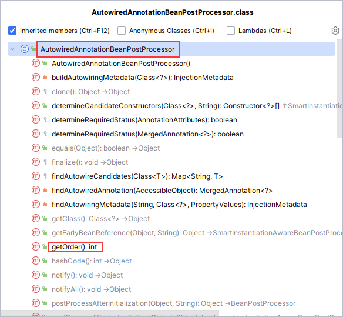
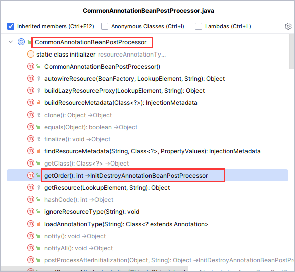

# 1.Bean后处理器底层如何排序，内部又是如何加载

## 1.1在进行后处理器排序中使用的比较器

**这是我们设置了排序顺序的代码，这里使用的 `beanFactory.getDependencyComparator()` 比较器**

```java
beanFactory.getBeansOfType(BeanPostProcessor.class).values().stream()
                .sorted(beanFactory.getDependencyComparator())
                .forEach(beanPostProcessor -> {
                    System.out.println("添加了：" + beanPostProcessor.getClass().getName() + " 后处理器");
                    beanFactory.addBeanPostProcessor(beanPostProcessor);
                });
```

这个比较器其实来至于，**给 BeanFactory 添加一些注册注解配置处理器(registerAnnotationConfigProcessors)**时后加上的

```java
//给 BeanFactory 添加一些注册注解配置处理器
AnnotationConfigUtils.registerAnnotationConfigProcessors(beanFactory);
```


## 1.2各种处理器被添加的方法

位置：package org.springframework.context.annotation.AnnotationConfigUtils-registerAnnotationConfigProcessors()方法

**我们进入 `registerAnnotationConfigProcessors()` 方法然后进入 `registerAnnotationConfigProcessors()`方法**

```java
/*
    在给定的注册表中注册所有相关的注释后处理器。
    参数：registry ——要操作的注册表 
    	 source – 触发此注册的配置源元素（已提取）。可能为null 。
    return：一组 BeanDefinitionHolders，包含所有已通过此调用实际注册的 bean 定义
*/
public static Set<BeanDefinitionHolder> registerAnnotationConfigProcessors(
    BeanDefinitionRegistry registry, @Nullable Object source) {

    DefaultListableBeanFactory beanFactory = unwrapDefaultListableBeanFactory(registry);
    if (beanFactory != null) {
        //如果beanFactory的比较器不是 AnnotationAwareOrderComparator，就设置：AnnotationAwareOrderComparator 比较器
        if (!(beanFactory.getDependencyComparator() instanceof AnnotationAwareOrderComparator)) {
            beanFactory.setDependencyComparator(AnnotationAwareOrderComparator.INSTANCE);
        }
        if (!(beanFactory.getAutowireCandidateResolver() instanceof ContextAnnotationAutowireCandidateResolver)) {
            beanFactory.setAutowireCandidateResolver(new ContextAnnotationAutowireCandidateResolver());
        }
    }
    //添加各种处理器，这里省略
    return beanDefs;
}
```

> 14行代码，就设置：AnnotationAwareOrderComparator 比较器


## 1.3那他们是如何排序

其实后处理器都实现了 Order 接口，有个 getOrder 的方法会返回一个整数，这个比较器就会根据这个整数从小到大排序

### 1.3.1 `AutowiredAnnotationBeanPostProcessor` 后处理器 

**getOrder()方法：**



**成员变量**

```java
private int order = Ordered.LOWEST_PRECEDENCE - 2;
```

> Ordered.LOWEST_PRECEDENCE：最低优先级，它时等于Integer.MAX_VALUE的

### 1.3.2 `CommonAnnotationBeanPostProcessor` 后处理器 



**构造方法：**

```java
public CommonAnnotationBeanPostProcessor() {
		setOrder(Ordered.LOWEST_PRECEDENCE - 3);
		setInitAnnotationType(PostConstruct.class);
		setDestroyAnnotationType(PreDestroy.class);
		ignoreResourceType("javax.xml.ws.WebServiceContext");

		// java.naming module present on JDK 9+?
		if (jndiPresent) {
			this.jndiFactory = new SimpleJndiBeanFactory();
		}
	}
```

> 第二行就是设置order，
>
> - Ordered.LOWEST_PRECEDENCE：最低优先级，它时等于Integer.MAX_VALUE的
>
> 这里我们可以知道，`CommonAnnotationBeanPostProcessor` 的 order 比 `AutowiredAnnotationBeanPostProcessor` 小，即它的优先级更大，所以在我们修改排序顺序后，`CommonAnnotationBeanPostProcessor` 先被添加

