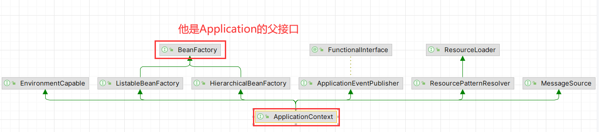
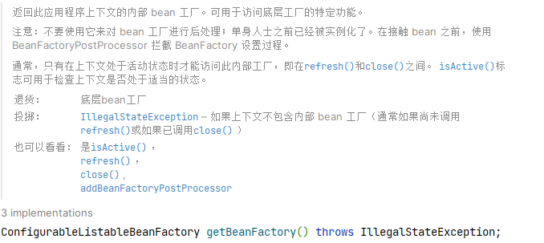
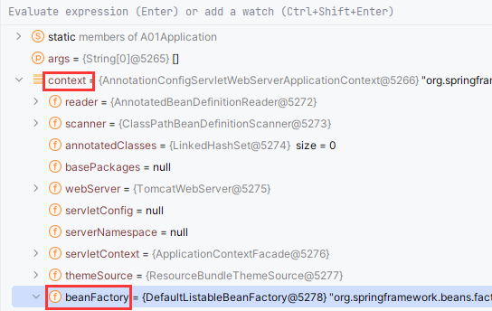
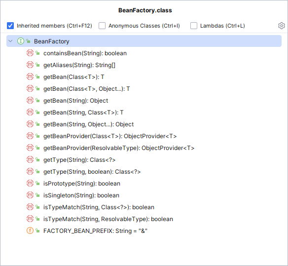
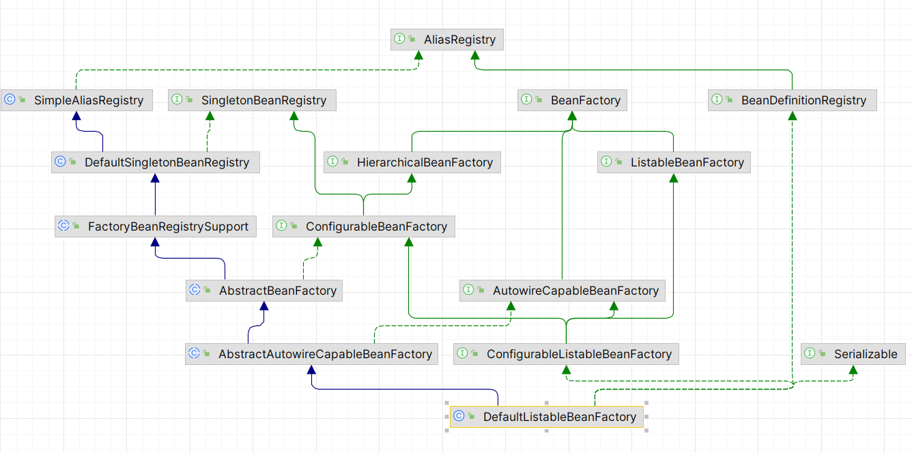
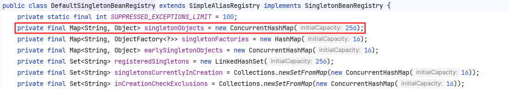
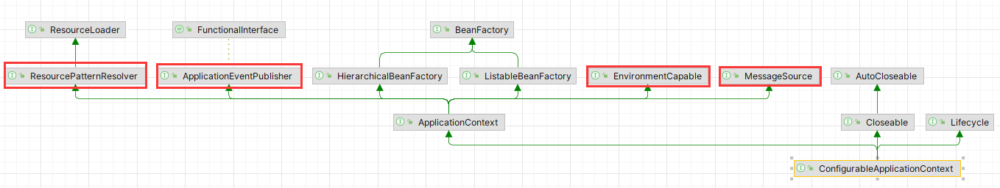
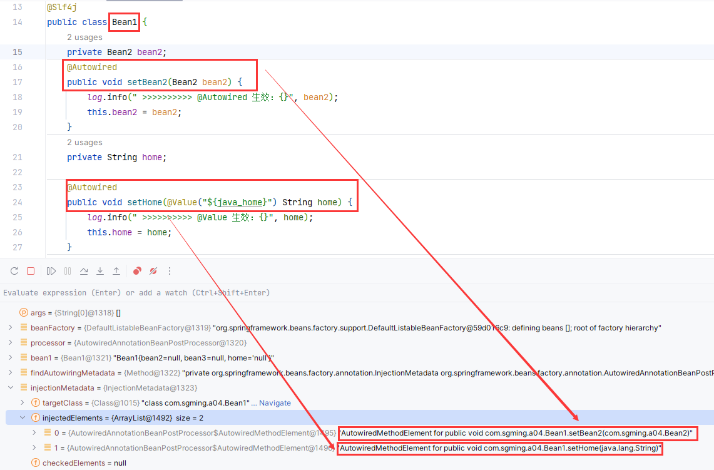
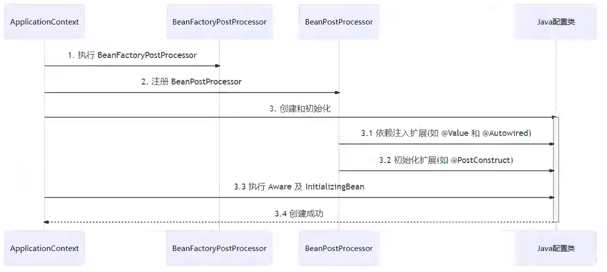
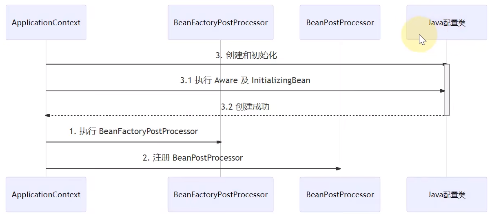

[TOC]


# 1.BeanFactory


## 1.1什么是BeanFactory


### 1.1.1BeanFactory是Application的父接口



### 1.1.2他才是Spring的核心容器，主要的ApplicationContext实现都是【组合】它的功能



> 这是 `Application` 的实现类 `ConfigurableApplicationContext` 的 `getBeanFactory()` 方法，可以看出是【**组合**】了**BeanFactory**的功能。也就是说，**BeanFactory**是**Application**的**成员变量**

**证明上述结论：(com.sgming.a01.A01Application)**

```java
@SpringBootApplication
@Slf4j
public class A01Application {
    public static void main(String[] args) {
        /*
        我们经常写这样的引导类，但这个run方法是有返回值的ConfigurableApplicationContext即可配置的Application
        BeanFactory是什么
            - Application的父接口
            - 它在是spring的核心容器，主要的ApplicationContext的实现都【组合】了它的功能
         */
        ConfigurableApplicationContext context = SpringApplication.run(A01Application.class, args);
        System.out.println(context);
    }
}
```

**在print加上断点调试，debug一下就可以看到**



> 从这里我们也可以看出，`BeanFactory`的实现类是`DefaultListableBeanFactory`


## 1.2BeanFactory能干什么


### 1.2.1BeanFactory接口的方法



> 表面看就是getBean，但 


### 1.2.2 `BeanFactory ` 的具体实现类 `DefaultListableBeanFactory`

#### 1.2.2.1具体Diagram



> 从这个Diagram可以看出，`DefaultListableBeanFactory`在原有的`BeanFactory`的基础上丰富了很多，其中`DefaultSingletonBeanFactory`就是我们熟悉的管理单例对象的对象

#### 1.2.2.2`DefaultListableBeanFactory`的父类`DefaultSingletonBeanFactory`



> Map<String, Object> singletonObjects属性就是我们存放单例对象的map集合，初始化大小是256

**通过反射获取`singletonObjects`这个成员变量(com.sgming.a01.A01Application)**

 ```java
 @SpringBootApplication
 @Slf4j
 public class A01Application {
     public static void main(String[] args) throws Exception {
         /*
         我们经常写这样的引导类，但这个run方法是有返回值的ConfigurableApplicationContext即可配置的Application
         BeanFactory是什么
             - Application的父接口
             - 它在是spring的核心容器，主要的ApplicationContext的实现都【组合】了它的功能
          */
         ConfigurableApplicationContext context = SpringApplication.run(A01Application.class, args);
         /*
         BeanFactory能干什么
             - 表面只是getBean
             - 实际上控制反转、基本的依赖注入、直至Bean的生命周期的各个功能，都由它的实现类提供，也就是：`DefaultListableBeanFactory`
          */
         Field singletonObjects = DefaultSingletonBeanRegistry.class.getDeclaredField("singletonObjects");
         singletonObjects.setAccessible(true);//因为是私有属性
         //因为singletonObjects属性是DefaultListableBeanFactory所有的，所以需要获取BeanFactory
         ConfigurableListableBeanFactory beanFactory = context.getBeanFactory();
         Map<String, Object> map = (Map<String, Object>) singletonObjects.get(beanFactory);
         map.entrySet().stream() //转化为流
                 .filter(e -> e.getKey().startsWith("component"))//进行过滤，必须是component开头
                 .forEach(e -> {//遍历
                     System.out.println(e.getKey() + "=" + e.getValue());
                 });
 
         /*
         Application 比 BeanFactory多点啥
          */
         //getMessage()，处理国际化能力
         System.out.println("\n======================getMessage()，处理国际化能力======================");
         System.out.println("中文：" + context.getMessage("hi", null, Locale.CHINA));
         System.out.println("英文：" + context.getMessage("hi", null, Locale.ENGLISH));
         System.out.println("日文：" + context.getMessage("hi", null, Locale.JAPAN));
     }
 }
 ```

> **强调一下：**
>
> **控制反转**、基本的**依赖注入**、直至**Bean的生命周期**的各个功能，都由它的实现类提供，也就是：`DefaultListableBeanFactory`


## 1.3`ApplicationContext`比`BeanFactory`扩展了那些功能



> 主要扩展功能如图

### 1.3.1 `MessageSource`

**处理国际化能力(com.sgming.a01.A01Application)**

```java
@SpringBootApplication
@Slf4j
public class A01Application {
    public static void main(String[] args) throws Exception {
        /*
        我们经常写这样的引导类，但这个run方法是有返回值的ConfigurableApplicationContext即可配置的Application
        BeanFactory是什么
            - Application的父接口
            - 它在是spring的核心容器，主要的ApplicationContext的实现都【组合】了它的功能
         */
        ConfigurableApplicationContext context = SpringApplication.run(A01Application.class, args);
        /*
        Application 比 BeanFactory多点啥
         */
        //getMessage()，处理国际化能力
        System.out.println("\n======================getMessage()，处理国际化能力======================");
        System.out.println("中文：" + context.getMessage("hi", null, Locale.CHINA));
        System.out.println("英文：" + context.getMessage("hi", null, Locale.ENGLISH));
        System.out.println("日文：" + context.getMessage("hi", null, Locale.JAPAN));
    }
}
```


### 1.3.2 `ResourcePatternResolver`

**根据通配符获取多个资源(com.sgming.a01.A01Application)**

```java
@SpringBootApplication
@Slf4j
public class A01Application {
    public static void main(String[] args) throws Exception {
        /*
        我们经常写这样的引导类，但这个run方法是有返回值的ConfigurableApplicationContext即可配置的Application
        BeanFactory是什么
            - Application的父接口
            - 它在是spring的核心容器，主要的ApplicationContext的实现都【组合】了它的功能
         */
        ConfigurableApplicationContext context = SpringApplication.run(A01Application.class, args);
        //getResources()，根据通配符获取多个资源
        System.out.println("\n===================getResources()，根据通配符获取多个资源================");
        Resource[] resources = context.getResources("classpath*:META-INF/spring.factories");
        for (Resource resource : resources) {
            System.out.println(resource);
        }
    }
}
```


### 1.3.3 `EnvironmentCapable`

**获取环境配置信息**

```java
@SpringBootApplication
@Slf4j
public class A01Application {
    public static void main(String[] args) throws Exception {
        /*
        我们经常写这样的引导类，但这个run方法是有返回值的ConfigurableApplicationContext即可配置的Application
        BeanFactory是什么
            - Application的父接口
            - 它在是spring的核心容器，主要的ApplicationContext的实现都【组合】了它的功能
         */
        ConfigurableApplicationContext context = SpringApplication.run(A01Application.class, args);
        //getEnvironment()，获取环境配置信息
        System.out.println("\n====================getEnvironment()，获取环境配置信息==================");
        System.out.println(context.getEnvironment().getProperty("java_home"));//不区分大小写
        System.out.println(context.getEnvironment().getProperty("server.port"));//不区分大小写
    }
}
```


### 1.3.4 `ApplicationEventPulisher`

**用于发布事件**，是一种解耦方法，这里举个简单的用户注册实例


**事件发布器(package com.sgming.a01.event.UserRegisterEvent)**

```java
public class UserRegisterEvent extends ApplicationEvent {
    //接收事件
    public UserRegisterEvent(Object source) {//事件源
        super(source);
    }
}
```


**事件监听器(package com.sgming.a01.listener.UserRegisterListener)**

```java
@Component
@Slf4j
public class UserRegisterListener {

    @EventListener
    public void userRegister(UserRegisterEvent event) {
        log.info("event: {}", event);
        log.info("发短信#");
    }
}
```


**事件发布源(package com.sgming.a01.component.UserController)**

```java
@Component
@Slf4j
public class UserController {
    //事件发布器
    @Autowired
    private ApplicationEventPublisher publisher;

    public void register() {
        log.info("用户注册");
        //发布事件：可以是邮箱，可以是短信， 发布源是User
        publisher.publishEvent(new UserRegisterEvent(this));
    }
}
```


**引导类(package com.sgming.a01.A01Application)**

```java
@SpringBootApplication
@Slf4j
public class A01Application {
    public static void main(String[] args) throws Exception {
        /*
        我们经常写这样的引导类，但这个run方法是有返回值的ConfigurableApplicationContext即可配置的Application
        BeanFactory是什么
            - Application的父接口
            - 它在是spring的核心容器，主要的ApplicationContext的实现都【组合】了它的功能
         */
        ConfigurableApplicationContext context = SpringApplication.run(A01Application.class, args);
        //publicEvent()，发布事件
        System.out.println("\n=========================publicEvent()，发布事件=======================");
        //发布事件
        //context.publishEvent(new UserRegisterEvent(context));//事件源是context
        context.getBean(UserController.class).register();//用户注册事件发布
    }
}
```

## 1.4小节

- `BeanFactory` 与 `ApplicationContext` 并不仅仅是简单接口继承的关系，`ApplicationContext` 【**组合**】并【**扩展**】了 `BeanFactory` 的功能
- 新学习了一种解耦的方式


# 2. 容器的实现

这里我们主要研究`DefaultListableBeanFactory`，其他的实现类，不进行研究

## 2.1 `BeanFacoty` 的实现(com.sgming.a02.TestBeanFactory)

### 2.1.1通过bean的定义可以将bean注册进BeanFactory中

```java
@Slf4j
public class TestBeanFactory {
    public static void main(String[] args) {
        DefaultListableBeanFactory beanFactory = new DefaultListableBeanFactory();
        /*
        我们需要告诉beanFactory，bean的定义，控制反转。
        bean的定义:(bean的描述信息)
            - class
            - scope
            - destroy method
            - init method
            ...
         */
        AbstractBeanDefinition beanDefinition = BeanDefinitionBuilder.genericBeanDefinition(Config.class)
                .setScope("singleton")//设置模式
                .getBeanDefinition();//构建出bean定义
        beanFactory.registerBeanDefinition("config", beanDefinition);//将bean的定义注册进容器中
        System.out.println("添加注册注解配置处理器前：");
        for (String name : beanFactory.getBeanDefinitionNames()) {//遍历容器中所有被定义的bean的名称
            System.out.println(name);
        }
    }
    static class Config {
        @Bean
        public Bean1 bean1() {
            return new Bean1();
        }
        @Bean
        public Bean2 bean2() {
            return new Bean2();
        }
    }
    static class Bean1 {
        public Bean1() {
            log.info("Bean1的构造方法");
        }
        @Autowired
        private Bean2 bean2;

        public Bean2 getBean2() {
            return bean2;
        }
    }
    static class Bean2 {
        public Bean2() {
            log.info("Bean2的构造方法");
        }
    }
}
```

**运行结果：**

```tex
添加注册注解配置处理器前：
config

Process finished with exit code 0
```

> 从上面的运行结果我们可以知道：bean1和bean2并没有被注册进容器，即 @Bean没有被解析，即这个功能（解析@Bean）不是 BeanFactory 提供的
>
> 我们给BeanFactory添加一些`registerAnnotationConfigProcessors`

### 2.1.2为BeanFactory添加`registerAnnotationConfigProcessors`

```java
@Slf4j
public class TestBeanFactory {
    public static void main(String[] args) {
        DefaultListableBeanFactory beanFactory = new DefaultListableBeanFactory();
        /*
        我们需要告诉beanFactory，bean的定义，控制反转。
        bean的定义:(bean的描述信息)
            - class
            - scope
            - destroy method
            - init method
            ...
         */
        AbstractBeanDefinition beanDefinition = BeanDefinitionBuilder.genericBeanDefinition(Config.class)
                .setScope("singleton")//设置模式
                .getBeanDefinition();//构建出bean定义
        beanFactory.registerBeanDefinition("config", beanDefinition);//将bean的定义注册进容器中
        System.out.println("添加注册注解配置处理器前：");
        for (String name : beanFactory.getBeanDefinitionNames()) {//遍历容器中所有被定义的bean的名称
            System.out.println(name);
        }
        /*
        通过上面打印了只有config，说明我们的bean1和bean2并没有被注册进容器，也就是我们@Bean没有被解析，并且这个功能不是BeanFactory提供的
        需要我们给BeanFactory添加这些功能
         */
        //给 BeanFactory 添加一些注册注解配置处理器
        System.out.println("\n添加一些注册注解配置处理器后：");
        AnnotationConfigUtils.registerAnnotationConfigProcessors(beanFactory);
        for (String name : beanFactory.getBeanDefinitionNames()) {//遍历容器中所有被定义的bean的名称
            System.out.println(name);
        }
    }
    static class Config {
        @Bean
        public Bean1 bean1() {
            return new Bean1();
        }

        @Bean
        public Bean2 bean2() {
            return new Bean2();
        }
    }
    static class Bean1 {
        public Bean1() {
            log.info("Bean1的构造方法");
        }
        @Autowired
        private Bean2 bean2;

        public Bean2 getBean2() {
            return bean2;
        }
    }
    static class Bean2 {
        public Bean2() {
            log.info("Bean2的构造方法");
        }
    }
}
```

**运行结果：**

```tex
添加注册注解配置处理器前：
config

添加一些注册注解配置处理器后：
config
org.springframework.context.annotation.internalConfigurationAnnotationProcessor
org.springframework.context.annotation.internalAutowiredAnnotationProcessor
org.springframework.context.annotation.internalCommonAnnotationProcessor
org.springframework.context.event.internalEventListenerProcessor
org.springframework.context.event.internalEventListenerFactory
```

> 可以看到添加了很多的后处理器，但是我们的@Bean仍然没有被解析，这是因为这些后处理器还没有工作

### 2.1.3刚刚添加的后处理中，让BeanFactory后处理运行

这些BeanFactory后处理器，是补充了一些Bean的定义，如：@Bean注解

```java
@Slf4j
public class TestBeanFactory {
    public static void main(String[] args) {
        DefaultListableBeanFactory beanFactory = new DefaultListableBeanFactory();
        /*
        我们需要告诉beanFactory，bean的定义，控制反转。
        bean的定义:(bean的描述信息)
            - class
            - scope
            - destroy method
            - init method
            ...
         */
        AbstractBeanDefinition beanDefinition = BeanDefinitionBuilder.genericBeanDefinition(Config.class)
                .setScope("singleton")//设置模式
                .getBeanDefinition();//构建出bean定义
        beanFactory.registerBeanDefinition("config", beanDefinition);//将bean的定义注册进容器中
        System.out.println("添加注册注解配置处理器前：");
        for (String name : beanFactory.getBeanDefinitionNames()) {//遍历容器中所有被定义的bean的名称
            System.out.println(name);
        }
        /*
        通过上面打印了只有config，说明我们的bean1和bean2并没有被注册进容器，也就是我们@Bean没有被解析，并且这个功能不是BeanFactory提供的
        需要我们给BeanFactory添加这些功能
         */
        //给 BeanFactory 添加一些注册注解配置处理器
        System.out.println("\n添加一些注册注解配置处理器后：");
        AnnotationConfigUtils.registerAnnotationConfigProcessors(beanFactory);
        for (String name : beanFactory.getBeanDefinitionNames()) {//遍历容器中所有被定义的bean的名称
            System.out.println(name);
        }
        //让添加的处理器中有关BeanFactory后处理器工作
        System.out.println("\n添加了哪些BeanFactory后处理器工作");
        beanFactory.getBeansOfType(BeanFactoryPostProcessor.class).values().forEach(beanFactoryPostProcessor -> {
            System.out.println("添加了：" + beanFactoryPostProcessor.getClass().getName() + "后处理器");
            beanFactoryPostProcessor.postProcessBeanFactory(beanFactory);//让BeanFactory后处理器工作
        });
        System.out.println("\n添加注册注解配置处理器并让BeanFactory后处理器工作后：");
        for (String name : beanFactory.getBeanDefinitionNames()) {//遍历容器中所有被定义的bean的名称
            System.out.println(name);
        }
    }
    static class Config {
        @Bean
        public Bean1 bean1() {
            return new Bean1();
        }

        @Bean
        public Bean2 bean2() {
            return new Bean2();
        }
    }
    static class Bean1 {
        public Bean1() {
            log.info("Bean1的构造方法");
        }
        @Autowired
        private Bean2 bean2;

        public Bean2 getBean2() {
            return bean2;
        }
    }
    static class Bean2 {
        public Bean2() {
            log.info("Bean2的构造方法");
        }
    }
}
```

**运行结果：**

```tex
添加注册注解配置处理器前：
config

添加一些注册注解配置处理器后：
config
org.springframework.context.annotation.internalConfigurationAnnotationProcessor
org.springframework.context.annotation.internalAutowiredAnnotationProcessor
org.springframework.context.annotation.internalCommonAnnotationProcessor
org.springframework.context.event.internalEventListenerProcessor
org.springframework.context.event.internalEventListenerFactory

添加了哪些BeanFactory后处理器工作：
20:55:45.518 [main] DEBUG org.springframework.beans.factory.support.DefaultListableBeanFactory - Creating shared instance of singleton bean 'org.springframework.context.annotation.internalConfigurationAnnotationProcessor'
20:55:45.538 [main] DEBUG org.springframework.beans.factory.support.DefaultListableBeanFactory - Creating shared instance of singleton bean 'org.springframework.context.event.internalEventListenerProcessor'
添加了：org.springframework.context.annotation.ConfigurationClassPostProcessor后处理器
添加了：org.springframework.context.event.EventListenerMethodProcessor后处理器
20:55:45.620 [main] DEBUG org.springframework.beans.factory.support.DefaultListableBeanFactory - Creating shared instance of singleton bean 'org.springframework.context.event.internalEventListenerFactory'

添加注册注解配置处理器并让BeanFactory后处理器工作后：
config
org.springframework.context.annotation.internalConfigurationAnnotationProcessor
org.springframework.context.annotation.internalAutowiredAnnotationProcessor
org.springframework.context.annotation.internalCommonAnnotationProcessor
org.springframework.context.event.internalEventListenerProcessor
org.springframework.context.event.internalEventListenerFactory
bean1
bean2
```

> 被实例的有：
>
> - internalConfigurationAnnotationProcessor
> - internalEventListenerProcessor
> - internalEventListenerFactory
>
> BeanFactory后处理有：
>
> - internalConfigurationAnnotationProcessor：内部配置注解处理器，处理@Bean这些注解
> - internalEventListenerProcessor：内部事件监听处理器
>
> 从上面我们也能看出一个问题，在bean1中我们自动注入了一个bean2，也就是说bean1依赖bean2，那么应该bean2先被注入

**问题：我们通过容器去获取bean1，再调用bean1的getBean2()方法并打印，打印结果是什么**

```java
@Slf4j
public class TestBeanFactory {
    public static void main(String[] args) {
        DefaultListableBeanFactory beanFactory = new DefaultListableBeanFactory();
        AbstractBeanDefinition beanDefinition = BeanDefinitionBuilder.genericBeanDefinition(Config.class)
                .setScope("singleton")//设置模式
                .getBeanDefinition();//构建出bean定义
        beanFactory.registerBeanDefinition("config", beanDefinition);//将bean的定义注册进容器中
        /*
        通过上面打印了只有config，说明我们的bean1和bean2并没有被注册进容器，也就是我们@Bean没有被解析，并且这个功能不是BeanFactory提供的
        需要我们给BeanFactory添加这些功能
         */
        //给 BeanFactory 添加一些注册注解配置处理器
        AnnotationConfigUtils.registerAnnotationConfigProcessors(beanFactory);
        //让添加的处理器中有关BeanFactory后处理器工作
        beanFactory.getBeansOfType(BeanFactoryPostProcessor.class).values().forEach(beanFactoryPostProcessor -> {
            beanFactoryPostProcessor.postProcessBeanFactory(beanFactory);//让BeanFactory后处理器工作
        });
        System.out.println("容器获取bean1中的属性bean2:" + beanFactory.getBean(Bean1.class).getBean2());
    }
	//省略了之前的Config、Bean1、Bean2
}
```

**运行结果：**

```tex
21:06:09.307 [main] INFO com.sgming.a02.TestBeanFactory - Bean1的构造方法
容器获取bean1中的属性bean2:null
```

> 通过结果我们知道Bean2的定义已经被加载进了 `BeanFactory ` 中，但bean2并没有成功自动装配(`@Autowired`)进Bean1，即 `@Autowired`没有被解析
>
> 这需要 Bean 后处理器

### 2.1.4添加并运行 Bean 后处理器

Bean 后处理器，针对 Bean 的生命周期的各个阶段提供扩展，例如 @Autowired @Resource...

```java
@Slf4j
public class TestBeanFactory {
    public static void main(String[] args) {
        DefaultListableBeanFactory beanFactory = new DefaultListableBeanFactory();
        /*
        我们需要告诉beanFactory，bean的定义，控制反转。
        bean的定义:(bean的描述信息)
            - class
            - scope
            - destroy method
            - init method
            ...
         */
        AbstractBeanDefinition beanDefinition = BeanDefinitionBuilder.genericBeanDefinition(Config.class)
                .setScope("singleton")//设置模式
                .getBeanDefinition();//构建出bean定义
        beanFactory.registerBeanDefinition("config", beanDefinition);//将bean的定义注册进容器中
        System.out.println("添加注册注解配置处理器前：");
        for (String name : beanFactory.getBeanDefinitionNames()) {//遍历容器中所有被定义的bean的名称
            System.out.println(name);
        }
        /*
        通过上面打印了只有config，说明我们的bean1和bean2并没有被注册进容器，也就是我们@Bean没有被解析，并且这个功能不是BeanFactory提供的
        需要我们给BeanFactory添加这些功能
         */
        //给 BeanFactory 添加一些注册注解配置处理器

        AnnotationConfigUtils.registerAnnotationConfigProcessors(beanFactory);
        System.out.println("\n添加一些注册注解配置处理器后：");
        for (String name : beanFactory.getBeanDefinitionNames()) {//遍历容器中所有被定义的bean的名称
            System.out.println(name);
        }
        //让添加的处理器中有关BeanFactory后处理器(BeanFactoryPostProcessor)工作
        System.out.println("\n添加了哪些BeanFactory后处理器工作:");
        beanFactory.getBeansOfType(BeanFactoryPostProcessor.class).values().forEach(beanFactoryPostProcessor -> {
            System.out.println("添加了：" + beanFactoryPostProcessor.getClass().getName() + " 后处理器");
            beanFactoryPostProcessor.postProcessBeanFactory(beanFactory);//让BeanFactory后处理器工作
        });
        System.out.println("\n添加注册注解配置处理器并让BeanFactory后处理器工作后：");
        for (String name : beanFactory.getBeanDefinitionNames()) {//遍历容器中所有被定义的bean的名称
            System.out.println(name);
        }
        //如果添加了Bean后处理一定要注释下面获取Bean1，因为Bean1是单例的，我们去获取它，它就会被实例且只有一份，添加Bean后处理后，就没有效果了，获取的仍是这个不完整的Bean1
        //System.out.println("容器获取bean1中的属性bean2:" + beanFactory.getBean(Bean1.class).getBean2());

        //Bean 后处理器，针对 Bean 的生命周期的各个阶段提供扩展，例如 @Autowired @Resource...
        //添加运行Bean后处理(BeanPostProcessor)
        System.out.println("\n添加了哪些Bean后处理器工作:");
        beanFactory.getBeansOfType(BeanPostProcessor.class).values().forEach(beanPostProcessor -> {
            System.out.println("添加了：" + beanPostProcessor.getClass().getName() + " 后处理器");
            beanFactory.addBeanPostProcessor(beanPostProcessor);
        });
        System.out.println("\n添加Bean后处理器后：");
        System.out.println("容器获取bean1中的属性bean2:" + beanFactory.getBean(Bean1.class).getBean2());

    }
}
```

**运行结果：**

```tex
添加了哪些Bean后处理器工作:
21:44:11.181 [main] DEBUG org.springframework.beans.factory.support.DefaultListableBeanFactory - Creating shared instance of singleton bean 'org.springframework.context.annotation.internalAutowiredAnnotationProcessor'
21:44:11.184 [main] DEBUG org.springframework.beans.factory.support.DefaultListableBeanFactory - Creating shared instance of singleton bean 'org.springframework.context.annotation.internalCommonAnnotationProcessor'
添加了：org.springframework.beans.factory.annotation.AutowiredAnnotationBeanPostProcessor 后处理器
添加了：org.springframework.context.annotation.CommonAnnotationBeanPostProcessor 后处理器

添加Bean后处理器后：
21:44:11.189 [main] DEBUG org.springframework.beans.factory.support.DefaultListableBeanFactory - Creating shared instance of singleton bean 'bean1'
21:44:11.191 [main] DEBUG org.springframework.beans.factory.support.DefaultListableBeanFactory - Creating shared instance of singleton bean 'config'
21:44:11.198 [main] INFO com.sgming.a02.TestBeanFactory - Bean1的构造方法
21:44:11.208 [main] DEBUG org.springframework.beans.factory.support.DefaultListableBeanFactory - Creating shared instance of singleton bean 'bean2'
21:44:11.208 [main] INFO com.sgming.a02.TestBeanFactory - Bean2的构造方法
容器获取bean1中的属性bean2:com.sgming.a02.TestBeanFactory$Bean2@8e24743
```

> 添加的 Bean 后处理器：
>
> - internalAutowiredAnnotationProcessor：用于解析 `@Autowired` 等注解
> - internalCommonAnnotationProcessor：用于解析 `@Resource` 注解，`@Resource` 并不是Spring中的提供的注解，而是java提供的
>
> 被实例化的Bean：
>
> - internalAutowiredAnnotationProcessor
> - internalCommonAnnotationProcessor
> - bean1
> - bean2
> - config
>
> 我们还可以发现，只有我们需要用到对应的 Bean 的时候才会被实例化(instance)，你可以调用BeanFactory的preInstantiateSingletons()，可以提前加载单例 Bean
>
> 添加后运行结果：
>
> ```tex
> 添加Bean后处理器后：
> 21:57:56.577 [main] DEBUG org.springframework.beans.factory.support.DefaultListableBeanFactory - Creating shared instance of singleton bean 'config'
> 21:57:56.581 [main] DEBUG org.springframework.beans.factory.support.DefaultListableBeanFactory - Creating shared instance of singleton bean 'bean1'
> 21:57:56.583 [main] INFO com.sgming.a02.TestBeanFactory - Bean1的构造方法
> 21:57:56.588 [main] DEBUG org.springframework.beans.factory.support.DefaultListableBeanFactory - Creating shared instance of singleton bean 'bean2'
> 21:57:56.589 [main] INFO com.sgming.a02.TestBeanFactory - Bean2的构造方法
> >>>>>>>>>>>>>>>>>>>>>>>>>>>>>>
> 容器获取bean1中的属性bean2:com.sgming.a02.TestBeanFactory$Bean2@396e2f39
> ```

**学到了：**

- BeanFactory 不会做的事
  - 不会主动调用 BeanFactory 后处理器
  - 不会主动调用 Bean 后处理器
  - 不会主动初始化单例
  - 不会解析 beanFactory 还不会解析 #{} 和 ${}
- Bean 后处理器会有排序逻辑

### 2.1.5 Bean 后处理器排序问题

我们添加Inter接口，让Bean3和Bean4去实现Inter接口，并在Config中将Bean3和Bean4使用@Bean注入到容器中。

我们知道：

- Autowired：如果一个类型有多个Bean，Autowired会根据成员变量名进行匹配
- Resource：如果一个类型有多个Bean，Resource会根据name属性的value进行匹配，如果name没有被赋值，则会按照成员变量名匹配

#### 2.1.5.1 默认排序

```java
@Slf4j
public class TestBeanFactory {
    public static void main(String[] args) {
        DefaultListableBeanFactory beanFactory = new DefaultListableBeanFactory();
        /*
        我们需要告诉beanFactory，bean的定义，控制反转。
        bean的定义:(bean的描述信息)
            - class
            - scope
            - destroy method
            - init method
            ...
         */
        AbstractBeanDefinition beanDefinition = BeanDefinitionBuilder.genericBeanDefinition(Config.class)
                .setScope("singleton")//设置模式
                .getBeanDefinition();//构建出bean定义
        beanFactory.registerBeanDefinition("config", beanDefinition);//将bean的定义注册进容器中
        System.out.println("添加注册注解配置处理器前：");
        for (String name : beanFactory.getBeanDefinitionNames()) {//遍历容器中所有被定义的bean的名称
            System.out.println(name);
        }
        /*
        通过上面打印了只有config，说明我们的bean1和bean2并没有被注册进容器，也就是我们@Bean没有被解析，并且这个功能不是BeanFactory提供的
        需要我们给BeanFactory添加这些功能
         */
        //给 BeanFactory 添加一些注册注解配置处理器

        AnnotationConfigUtils.registerAnnotationConfigProcessors(beanFactory);
        System.out.println("\n添加一些注册注解配置处理器后：");
        for (String name : beanFactory.getBeanDefinitionNames()) {//遍历容器中所有被定义的bean的名称
            System.out.println(name);
        }
        //让添加的处理器中有关BeanFactory后处理器(BeanFactoryPostProcessor)工作
        System.out.println("\n添加了哪些BeanFactory后处理器工作:");
        beanFactory.getBeansOfType(BeanFactoryPostProcessor.class).values().forEach(beanFactoryPostProcessor -> {
            System.out.println("添加了：" + beanFactoryPostProcessor.getClass().getName() + " 后处理器");
            beanFactoryPostProcessor.postProcessBeanFactory(beanFactory);//让BeanFactory后处理器工作
        });
        System.out.println("\n添加注册注解配置处理器并让BeanFactory后处理器工作后：");
        for (String name : beanFactory.getBeanDefinitionNames()) {//遍历容器中所有被定义的bean的名称
            System.out.println(name);
        }
        //如果添加了Bean后处理一定要注释下面获取Bean1，因为Bean1是单例的，我们去获取它，它就会被实例且只有一份，添加Bean后处理后，就没有效果了，获取的仍是这个不完整的Bean1
        //System.out.println("容器获取bean1中的属性bean2:" + beanFactory.getBean(Bean1.class).getBean2());

        //Bean 后处理器，针对 Bean 的生命周期的各个阶段提供扩展，例如 @Autowired @Resource...
        //添加运行Bean后处理(BeanPostProcessor)
        System.out.println("\n添加了哪些Bean后处理器工作:");
        beanFactory.getBeansOfType(BeanPostProcessor.class).values().forEach(beanPostProcessor -> {
            System.out.println("添加了：" + beanPostProcessor.getClass().getName() + " 后处理器");
            beanFactory.addBeanPostProcessor(beanPostProcessor);
        });
        System.out.println("\n添加Bean后处理器后：");
        beanFactory.preInstantiateSingletons();
        System.out.println(">>>>>>>>>>>>>>>>>>>>>>>>>>>>>>");
        System.out.println("容器获取bean1中的属性bean2:" + beanFactory.getBean(Bean1.class).getBean2());

        System.out.println("容器中Bean1的Inter的具体注入的是：" + beanFactory.getBean(Bean1.class).getBean3());
    }
    static class Config {
        @Bean
        public Bean1 bean1() {
            return new Bean1();
        }
        @Bean
        public Bean2 bean2() {
            return new Bean2();
        }
        @Bean
        public Bean3 bean3() {
            return new Bean3();
        }
        @Bean
        public Bean4 bean4() {
            return new Bean4();
        }
    }
    interface Inter {
    }
    static class Bean3 implements Inter {
        public Bean3() {
            log.info("构造 Bean3");
        }
    }
    static class Bean4 implements Inter {
        public Bean4() {
            log.info("构造 Bean4");
        }
    }
    static class Bean1 {
        public Bean1() {
            log.info("Bean1的构造方法");
        }
        @Autowired
        private Bean2 bean2;
        //Autowired：如果一个类型有多个Bean，Autowired会根据成员变量名进行匹配
        //Resource：如果一个类型有多个Bean，Resource会根据name属性的value进行匹配，如果name没有被赋值，则会按照成员变量名匹配
        //问：这个bean3成员变量到底是谁
        @Autowired
        @Resource(name = "bean4")
        private Inter bean3;

        public Bean2 getBean2() {
            return bean2;
        }

        public Inter getBean3() {
            return bean3;
        }
    }
    static class Bean2 {
        public Bean2() {
            log.info("Bean2的构造方法");
        }
    }
}
```

**运行结果：**

```tex
容器中Bean1的Inter的具体注入的是：com.sgming.a02.TestBeanFactory$Bean3@150c158
```

> 我们可以看出，是`@Autowired`先起作用，这就是和 Bean 后处理器添加的顺序有关

那我们就改变这个 Bean 后处理器添加顺序


#### 2.1.5.2使用 `beanFactory.getDependencyComparator()` 比较器进行排序后

```java
@Slf4j
public class TestBeanFactory {
    public static void main(String[] args) {
        DefaultListableBeanFactory beanFactory = new DefaultListableBeanFactory();
        /*
        我们需要告诉beanFactory，bean的定义，控制反转。
        bean的定义:(bean的描述信息)
            - class
            - scope
            - destroy method
            - init method
            ...
         */
        AbstractBeanDefinition beanDefinition = BeanDefinitionBuilder.genericBeanDefinition(Config.class)
                .setScope("singleton")//设置模式
                .getBeanDefinition();//构建出bean定义
        beanFactory.registerBeanDefinition("config", beanDefinition);//将bean的定义注册进容器中
        /*
        通过上面打印了只有config，说明我们的bean1和bean2并没有被注册进容器，也就是我们@Bean没有被解析，并且这个功能不是BeanFactory提供的
        需要我们给BeanFactory添加这些功能
         */
        //给 BeanFactory 添加一些注册注解配置处理器

        AnnotationConfigUtils.registerAnnotationConfigProcessors(beanFactory);
        //让添加的处理器中有关BeanFactory后处理器(BeanFactoryPostProcessor)工作
        System.out.println("\n添加了哪些BeanFactory后处理器工作:");
        beanFactory.getBeansOfType(BeanFactoryPostProcessor.class).values().forEach(beanFactoryPostProcessor -> {
            beanFactoryPostProcessor.postProcessBeanFactory(beanFactory);//让BeanFactory后处理器工作
        });
        //Bean后处理器进行排序后
        beanFactory.getBeansOfType(BeanPostProcessor.class).values().stream()
                .sorted(beanFactory.getDependencyComparator())
                .forEach(beanPostProcessor -> {
                    System.out.println("添加了：" + beanPostProcessor.getClass().getName() + " 后处理器");
                    beanFactory.addBeanPostProcessor(beanPostProcessor);
                });

        System.out.println("\n添加Bean后处理器后：");
        beanFactory.preInstantiateSingletons();
        System.out.println("容器中Bean1的Inter的具体注入的是：" + beanFactory.getBean(Bean1.class).getBean3());
    }
}
```

**运行结果：**

```tex
添加了：org.springframework.context.annotation.CommonAnnotationBeanPostProcessor 后处理器
添加了：org.springframework.beans.factory.annotation.AutowiredAnnotationBeanPostProcessor 后处理器

容器中Bean1的Inter的具体注入的是：com.sgming.a02.TestBeanFactory$Bean4@2e3fc542
```

> 可以看到 `CommonAnnotationBeanPostProcessor` 先被添加，所以 `@Resource` 注解先被解析，注入的就是Bean4了
>
> 了解为什么会是这样，[Bean后处理器底层如何排序，内部又是如何加载](BeanPostProcessor.md)

## 2.2 `AplicationContext` 的常见实现和用法

### 2.2.1 `ClassPathXmlApplicationContext`

较为经典的容器，基于 classpath 下的 xml 格式配置文件来创建

<span id="ClassPathXmlApplicationContext">ClassPathXmlApplicationContext</span>

```java
public class A02Application {
    public static void main(String[] args) {
        testClassPathXmlApplicationContext();
    }

    private static void testClassPathXmlApplicationContext() {
        ClassPathXmlApplicationContext context = new ClassPathXmlApplicationContext("classpath:b01.xml");
        for (String name : context.getBeanDefinitionNames()) {
            System.out.println(name);
        }
        System.out.println("bean6是否成功注入bean5:");
        System.out.println(context.getBean(Bean6.class).getBean5());
    }
    private static void testFileSystemXmlApplicationContext() {
    }
    static class Bean5 {
    }
    static class Bean6 {
        private Bean5 bean5;

        public Bean5 getBean5() {
            return bean5;
        }

        public void setBean5(Bean5 bean5) {
            this.bean5 = bean5;
        }
    }
}
```

**对应的XML配置文件(resources:b01.xml)**

<span id="b01.xml">bo1.xml</span>

```xml
<?xml version="1.0" encoding="UTF-8"?>
<beans xmlns="http://www.springframework.org/schema/beans"
       xmlns:xsi="http://www.w3.org/2001/XMLSchema-instance"
       xsi:schemaLocation="http://www.springframework.org/schema/beans http://www.springframework.org/schema/beans/spring-beans.xsd">
    <bean id="bean5" class="com.sgming.a02.A02Application.Bean5"/>
    <bean id="bean6" class="com.sgming.a02.A02Application.Bean6">
        <property name="bean5" ref="bean5"/>
    </bean>
</beans>
```

**底层实现：**

```java
public class A02Application {
    public static void main(String[] args) {
        testClassPathXmlApplicationContext1();
    }
    private static void testClassPathXmlApplicationContext1() {
        DefaultListableBeanFactory beanFactory = new DefaultListableBeanFactory();
        System.out.println("读取前:");
        for (String name : beanFactory.getBeanDefinitionNames()) {
            System.out.println(name);
        }
        //加载Bean的定义信息(BeanDefinition)
        XmlBeanDefinitionReader reader = new XmlBeanDefinitionReader(beanFactory);
        reader.loadBeanDefinitions(new ClassPathResource("b01.xml"));
        System.out.println("\n读取后:");
        for (String name : beanFactory.getBeanDefinitionNames()) {
            System.out.println(name);
        }
        System.out.println("bean6是否成功注入bean5:");
        System.out.println(context.getBean(Bean6.class).getBean5());
    }
    //省略了Bean5和Bean6
}
```

### 2.2.2 `FileSystemXmlApplicationContext`

基于磁盘路径下 xml 格式的配置文件来创建

<span id="FileSystemXmlApplicationContext">FileSystemXmlApplicationContext</span>

```java
public class A02Application {
    public static void main(String[] args) {
        testFileSystemXmlApplicationContext();
    }
    private static void testFileSystemXmlApplicationContext() {
        System.out.println("==========testFileSystemXmlApplicationContext==========");
        //这里之所以没有些绝对路径是因为，run/debug configurations 里面配置了 work directory 配置了项目的路径
        FileSystemXmlApplicationContext context = new FileSystemXmlApplicationContext("bean-factory\\src\\main\\resources\\b01.xml");
        for (String name : context.getBeanDefinitionNames()) {
            System.out.println(name);
        }
        System.out.println("bean6是否成功注入bean5:");
        System.out.println(context.getBean(Bean6.class).getBean5());
    }
    //省略了Bean5和Bean6
}
```

**底层实现：**

```java
public class A02Application {
    public static void main(String[] args) {
        testFileSystemXmlApplicationContext2();
    }
    private static void testFileSystemXmlApplicationContext2() {
        System.out.println("==========testFileSystemXmlApplicationContext2==========");
        DefaultListableBeanFactory beanFactory = new DefaultListableBeanFactory();
        System.out.println("读取前:");
        for (String name : beanFactory.getBeanDefinitionNames()) {
            System.out.println(name);
        }
        XmlBeanDefinitionReader reader = new XmlBeanDefinitionReader(beanFactory);
        //加载Bean的定义信息(BeanDefinition)
        reader.loadBeanDefinitions(new FileSystemResource("bean-factory\\src\\main\\resources\\b01.xml"));
        System.out.println("\n读取后:");
        for (String name : beanFactory.getBeanDefinitionNames()) {
            System.out.println(name);
        }
        System.out.println("bean6是否成功注入bean5:");
        System.out.println(context.getBean(Bean6.class).getBean5());
    }
    //省略了Bean5和Bean6
}
```

### 2.2.3 `AnnotationConfigApplicationContext` 

较为经典的容器，基于 java config 的方式来创建

```java
public class A02Application {
    public static void main(String[] args) {
        testAnnotationConfigApplicationContext();
    }

    private static void testAnnotationConfigApplicationContext() {
        AnnotationConfigApplicationContext context = new AnnotationConfigApplicationContext(ConfigA01.class);
        for (String name : context.getBeanDefinitionNames()) {
            System.out.println(name);
        }
        System.out.println("bean6是否成功注入bean5:");
        System.out.println(context.getBean(Bean6.class).getBean5());
    }
    static class ConfigA01 {
        @Bean
        public Bean5 bean5() {
            return new Bean5();
        }
        @Bean
        public Bean6 bean6(Bean5 bean5) {
            Bean6 bean6 = new Bean6();
            bean6.setBean5(bean5);
            return bean6;
        }
    }
	//bean5和bean6省略了
}
```

**运行结果：**

```tex
org.springframework.context.annotation.internalConfigurationAnnotationProcessor
org.springframework.context.annotation.internalAutowiredAnnotationProcessor
org.springframework.context.annotation.internalCommonAnnotationProcessor
org.springframework.context.event.internalEventListenerProcessor
org.springframework.context.event.internalEventListenerFactory
a02Application.ConfigA01
bean5
bean6
bean6是否成功注入bean5:
com.sgming.a02.A02Application$Bean5@7ff2a664
```

> 我们可以发现，使用 `AnnotationConfigApplication` 容器，它自动添加了**处理器(registerAnnotationConfigProcessors)**，但是我们使用上面两个容器的时候并没有添加这些处理器
>
> 你可以在 [b01.xml](#b01.xml) 配置文件中添加 `<context:annotation-config/>` 然后再运行 [FileSystemXmlApplicationContext](#FileSystemXmlApplicationContext) 或 [ClassPathXmlApplicationContext](#ClassPathXmlApplicationContext) 对应容器的方法


### 2.2.4 `AnnotationConfigServletWebServerApplicationContext`

 ```java
 public class A02Application {
     public static void main(String[] args) {
         testClassPathXmlApplicationContext();
 
         AnnotationConfigServletWebServerApplicationContext();
     }
 
     private static void AnnotationConfigServletWebServerApplicationContext() {
         AnnotationConfigServletWebServerApplicationContext context = 
             new AnnotationConfigServletWebServerApplicationContext(WebConfig.class);
 
     }
     static class WebConfig {
         @Bean
         public ServletWebServerFactory servletWebServerFactory() {//内嵌一个web容器
             return new TomcatServletWebServerFactory();
         }
         @Bean
         public DispatcherServlet dispatcherServlet() {
             return new DispatcherServlet();//当前这个servlet还不知道运行再那个 web 容器上面
         }
         @Bean
         public DispatcherServletRegistrationBean registrationBean(DispatcherServlet dispatcherServlet) {
             //将 DispatcherServlet 注册进 web 容器中
             //"/" 拦截所有请求
             return new DispatcherServletRegistrationBean(dispatcherServlet, "/");
         }
         //一个简单的控制器，这里的 Controller 是接口，不是注解
         @Bean("/hello")//里面的参数是匹配的路径
         public Controller controller1() {
             return ((request, response) -> {
                 response.getWriter().print("hello");//向页面写一个hello
                 return null;
             });
         }
     }
 }
 ```

### 2.2.5总结

学到了：

- 常见的 Application 容器实现
- 内嵌容器、DispatchServlet 的创建方法、作用


# 3.Bean的生命周期

## 3.1环境搭建

### 3.1.1<span id="A03Application">A03Application</span>

**路径：**com.sgming.a03.A03Application

```java
@SpringBootApplication
public class A03Application {
    public static void main(String[] args) {
        ConfigurableApplicationContext context = SpringApplication.run(A03Application.class, args);
        context.close();
    }
}
```

### 3.1.2<span id="LifeCycleBean">LifeCycleBean</span>

**路径：**com.sgming.a03.LifeCycleBean

```java
@Component
@Slf4j
public class LifeCycleBean {
    public LifeCycleBean() {
        log.info("构造方法");
    }
    @Autowired
    public void autowire(@Value("${JAVA_HOME}") String home) {
        log.info("依赖注入：{}", home);
    }
    @PostConstruct
    public void init() {
        log.info("初始化");
    }
    @PreDestroy
    public void destroy() {
        log.info("销毁");
    }
}
```


## 3.2Spring Bean 生命周期的各个阶段

### 3.2.1查看基本的Bean的生命周期

**运行引导类[A03Application](#A03Application)**

**运行结果：**

```tex
构造方法
依赖注入：D:\WorkSoftware\JAVA\1.8\jdk1.8.0_91
初始化
销毁
```

> 可以看出Bean的生命周期
>
> - 构造方法
> - 依赖注入
> - 初始化
> - 销毁（容器close前执行）


### 3.2.2拓展了Bean的生命周期的 `Bean后处理器`

**<span id="MyBeanPostProcessor">MyBeanPostProcessor</span>**

**路径：**com.sgming.a03.MyBeanPostProcessor

```java
@Component
@Slf4j
public class MyBeanPostProcessor implements InstantiationAwareBeanPostProcessor, DestructionAwareBeanPostProcessor {
    @Override
    public void postProcessBeforeDestruction(Object bean, String beanName) throws BeansException {
        if (beanName.equals("lifeCycleBean")) {
            log.info(">>>>>>>>>> 销毁前执行，如 @PreDestroy");
        }
    }


    @Override
    public Object postProcessBeforeInstantiation(Class<?> beanClass, String beanName) throws BeansException {
        if (beanName.equals("lifeCycleBean")) {
            log.info(">>>>>>>>>> 实例化前执行，这里返回的对象会替换原本的 bean");
        }
        return null;
    }

    @Override
    public boolean postProcessAfterInstantiation(Object bean, String beanName) throws BeansException {
        if (beanName.equals("lifeCycleBean")) {
            log.info(">>>>>>>>>> 实例化后执行，如果这里返回 false 会跳过依赖注入的阶段");
        }
        return true;
    }

    @Override
    public PropertyValues postProcessProperties(PropertyValues pvs, Object bean, String beanName) throws BeansException {
        if (beanName.equals("lifeCycleBean")) {
            log.info(">>>>>>>>>> 依赖注入阶段会执行，如 @Autowired、@Value、@Resource");
        }
        return pvs;
    }

    @Override
    public Object postProcessBeforeInitialization(Object bean, String beanName) throws BeansException {
        if (beanName.equals("lifeCycleBean")) {
            log.info(">>>>>>>>>> 初始化之前执行，这里返回的对象会替换原本的 bean，如 @PostConstruct、@ConfigurationProperties");
        }
        return bean;
    }

    @Override
    public Object postProcessAfterInitialization(Object bean, String beanName) throws BeansException {
        if (beanName.equals("lifeCycleBean")) {
            log.info(">>>>>>>>>> 初始化之后执行，这里返回的对象会替换原本的 bean，如代理增强");
        }
        return bean;
    }
}
```

> 这里我们自己写了一个类它实现了 `InstantiationAwareBeanPostProcessor`, `DestructionAwareBeanPostProcessor` 那这个类就可以理解为是一个 Bean后处理器了

**再次运行引导类[A03Application](#A03Application),的运行结果：**

```tex
>>>>>>>>>> 实例化前执行，这里返回的对象会替换原本的 bean
构造方法
>>>>>>>>>> 实例化后执行，如果这里返回 false 会跳过依赖注入的阶段
>>>>>>>>>> 依赖注入阶段会执行，如 @Autowired、@Value、@Resource
依赖注入：D:\WorkSoftware\JAVA\1.8\jdk1.8.0_91
>>>>>>>>>> 初始化之前执行，这里返回的对象会替换原本的 bean，如 @PostConstruct、@ConfigurationProperties
初始化
>>>>>>>>>> 初始化之后执行，这里返回的对象会替换原本的 bean，如代理增强
>>>>>>>>>> 销毁前执行，如 @PreDestroy
销毁
```

## 3.3模板设计方法

```java
public class TestMethodTemplate {
    public static void main(String[] args) {
        MyBeanFactory beanFactory = new MyBeanFactory();
        //添加具体的后处理器实现
        beanFactory.addBeanPostProcessor(bean -> {
            System.out.println(">>>>>> 解析 @Autowired");
        });
        beanFactory.getBean();
    }
    // 模板方法 Template Method Pattern
    static class MyBeanFactory {
        private List<BeanPostProcessor> processors = new ArrayList<>();

        public Object getBean() {
            Object bean = new Object();
            System.out.println("构造 " + bean);
            System.out.println("依赖注入 " + bean);
            //再依赖注入后，调用 Bean后处理器 的扩展方法
            for (BeanPostProcessor processor : processors) {
                processor.inject(bean);
            }
            System.out.println("初始化 " + bean);
            return bean;
        }
        public void addBeanPostProcessor(BeanPostProcessor beanPostProcessor) {
            //添加对应的自定义的 Bean后处理器
            processors.add(beanPostProcessor);
        }

    }
    //对未知的扩展，定义未接口，让具体的实现去实现它
    static interface BeanPostProcessor {
        void inject(Object bean);// 对依赖注入阶段扩展
    }
}
```


# 4.Bean 后处理器

## 4.1环境

### 4.1.1<span id="Bean1">Bean1</span>

**路径：**com.sgming.a04.Bean1

```java
@Component
@Slf4j
public class Bean1 {
    private Bean2 bean2;

    @Autowired
    public void setBean2(Bean2 bean2) {
        log.info(" >>>>>>>>>> @Autowired 生效：{}", bean2);
        this.bean2 = bean2;
    }

    private Bean3 bean3;

    @Resource
    public void setBean3(Bean3 bean3) {
        log.info(" >>>>>>>>>> @Resource 生效：{}", bean3);
        this.bean3 = bean3;
    }

    private String home;

    @Autowired
    public void setHome(@Value("${java_home}") String home) {
        log.info(" >>>>>>>>>> @Value 生效：{}", home);
        this.home = home;
    }
    @PostConstruct
    public void init() {
        log.info(" >>>>>>>>>> @PostConstruct 生效");
    }
    @PreDestroy
    public void destroy() {
        log.info(" >>>>>>>>>> @PreDestroy 生效");
    }

    @Override
    public String toString() {
        return "Bean1{" +
                "bean2=" + bean2 +
                ", bean3=" + bean3 +
                ", home='" + home + '\'' +
                '}';
    }
}
```

### 4.1.2<span id="Bean2">Bean2</span>

**路径：**com.sgming.a04.Bean2

```java
public class Bean2 {
}
```

### 4.1.3<span id="Bean3">Bean3</span>

**路径：**com.sgming.a04.Bean3

```ja va
public class Bean3 {
}
```

### 4.1.4<span id="Bean4">Bean4</span>

**路径：**com.sgming.a04.Bean4

```java
@Component
@ConfigurationProperties(prefix = "java")
public class Bean4 {
    private String home;
    private String version;

    public String getHome() {
        return home;
    }

    public void setHome(String home) {
        this.home = home;
    }

    public String getVersion() {
        return version;
    }

    public void setVersion(String version) {
        this.version = version;
    }

    @Override
    public String toString() {
        return "Bean4{" +
                "home='" + home + '\'' +
                ", version='" + version + '\'' +
                '}';
    }
}
```

> 如果没有加 `@Component`  注解，会爆红，但并不影响，因为我们没有使用 `@Component` 去注入Bean

### 4.1.5<span id="A04Application">A04Application</span>

**路径：**com.sgming.a04.A04Application

```java
public class A04Application {
    public static void main(String[] args) {
        // GenericApplicationContext 是一个【干净】的容器，没有添加 BeanFactory 后处理器和 Bean 后处理器
        GenericApplicationContext context = new GenericApplicationContext();

        // 给容器注册三个Bean
        context.registerBean("bean1", Bean1.class);
        context.registerBean("bean2", Bean2.class);
        context.registerBean("bean3", Bean3.class);

        // 初始化容器
        context.refresh(); // 执行添加的 BeanFactory 后处理器， 添加的 Bean 后处理器，初始化所有的单例

        //销毁容器
        context.close();
    }
}
```

运行结果：

```tex
org.springframework.context.support.GenericApplicationContext - Refreshing org.springframework.context.support.GenericApplicationContext@4361bd48
org.springframework.beans.factory.support.DefaultListableBeanFactory - Creating shared instance of singleton bean 'bean1'
org.springframework.beans.factory.support.DefaultListableBeanFactory - Creating shared instance of singleton bean 'bean2'
org.springframework.beans.factory.support.DefaultListableBeanFactory - Creating shared instance of singleton bean 'bean3'
org.springframework.context.support.GenericApplicationContext - Closing org.springframework.context.support.GenericApplicationContext@4361bd48, started on Wed Nov 30 09:24:58 CST 2022
```

> 这是没有添加任何 `Bean后处理器` 的容器运行的结果

## 4.2Bean 后处理器的作用

**在 Bean 的各个生命周期提供扩展功能**


## 4.3常见的后处理器

所有的 `A04Application` 都是在[A04Application](#A04Application)上修改的

### 4.3.1添加 `AutowiredAnnotationBeanPostProcessor` 处理器

```java
public class A04Application {
    public static void main(String[] args) {
        // GenericApplicationContext 是一个【干净】的容器，没有添加 BeanFactory 后处理器和 Bean 后处理器
        GenericApplicationContext context = new GenericApplicationContext();

        // 给容器注册三个Bean
        context.registerBean("bean1", Bean1.class);
        context.registerBean("bean2", Bean2.class);
        context.registerBean("bean3", Bean3.class);

        //添加解析 @Autowired @Value 注解的后处理器
        context.registerBean(AutowiredAnnotationBeanPostProcessor.class);
        //设置 Autowired 候选解析器，它默认的解析器不能解析 值注入（@Value），所有使用 ContextAnnotationAutowireCandidateResolver解析器
        context.getDefaultListableBeanFactory().setAutowireCandidateResolver(
            new ContextAnnotationAutowireCandidateResolver());


        // 初始化容器
        context.refresh(); // 执行 BeanFactory 后处理器， 添加 Bean 后处理器，初始化所有的单例
        //销毁容器
        context.close();
    }
}
```

**运行结果：**

```tex
INFO com.sgming.a04.Bean1 -  >>>>>>>>>> @Value 生效：D:\WorkSoftware\JAVA\1.8\jdk1.8.0_91
INFO com.sgming.a04.Bean1 -  >>>>>>>>>> @Autowired 生效：com.sgming.a04.Bean2@23fe1d71
```

> `@Autowired` 和 `@Value` 注解别解析了

### 4.3.2添加 `CommonAnnotationBeanPostProcessor` 处理器

```java
public class A04Application {
    public static void main(String[] args) {
        // GenericApplicationContext 是一个【干净】的容器，没有添加 BeanFactory 后处理器和 Bean 后处理器
        GenericApplicationContext context = new GenericApplicationContext();

        // 给容器注册三个Bean
        context.registerBean("bean1", Bean1.class);
        context.registerBean("bean2", Bean2.class);
        context.registerBean("bean3", Bean3.class);

        //添加解析 @Autowired @Value 注解的后处理器
        context.registerBean(AutowiredAnnotationBeanPostProcessor.class);
        //设置 Autowired 候选解析器，它默认的解析器不能解析 值注入（@Value），所有使用 ContextAnnotationAutowireCandidateResolver解析器
        context.getDefaultListableBeanFactory().setAutowireCandidateResolver(new ContextAnnotationAutowireCandidateResolver());

        //添加解析 javax.annotation 包下的注解
        context.registerBean(CommonAnnotationBeanPostProcessor.class);

        // 初始化容器
        context.refresh(); // 执行 BeanFactory 后处理器， 添加 Bean 后处理器，初始化所有的单例
		//销毁容器
        context.close();
    }
}
```

**运行结果：**

```tex
INFO com.sgming.a04.Bean1 -  >>>>>>>>>> @Resource 生效：com.sgming.a04.Bean3@262b2c86
INFO com.sgming.a04.Bean1 -  >>>>>>>>>> @Autowired 生效：com.sgming.a04.Bean2@e720b71
INFO com.sgming.a04.Bean1 -  >>>>>>>>>> @Value 生效：D:\WorkSoftware\JAVA\1.8\jdk1.8.0_91
INFO com.sgming.a04.Bean1 -  >>>>>>>>>> @PostConstruct 生效
INFO com.sgming.a04.Bean1 -  >>>>>>>>>> @PreDestroy 生效
```

> 从里我们可以发现 `@Resource` 注解先被解析 [Bean后处理器的添加顺序](BeanPostProcessor.md) 呼应起来


### 4.3.3添加 `ConfigurationPropertiesBindingPostProcessor` 处理器

```java
public class A04Application {
    public static void main(String[] args) {
        // GenericApplicationContext 是一个【干净】的容器，没有添加 BeanFactory 后处理器和 Bean 后处理器
        GenericApplicationContext context = new GenericApplicationContext();

        // 给容器注册四个Bean
        context.registerBean("bean1", Bean1.class);
        context.registerBean("bean2", Bean2.class);
        context.registerBean("bean3", Bean3.class);
        context.registerBean("bean4", Bean4.class);

        //添加解析 @Autowired @Value 注解的后处理器
        context.registerBean(AutowiredAnnotationBeanPostProcessor.class);
        //设置 Autowired 候选解析器，它默认的解析器不能解析 值注入（@Value），所有使用 ContextAnnotationAutowireCandidateResolver解析器
        context.getDefaultListableBeanFactory()
            .setAutowireCandidateResolver(new ContextAnnotationAutowireCandidateResolver());

        //添加解析 javax.annotation 包下的注解
        context.registerBean(CommonAnnotationBeanPostProcessor.class);

        //添加 ConfigurationPropertiesBindingPostProcessor 处理器，解析：ConfigurationProperties注解
        ConfigurationPropertiesBindingPostProcessor.register(context.getDefaultListableBeanFactory());

        // 初始化容器
        context.refresh(); // 执行 BeanFactory 后处理器， 添加 Bean 后处理器，初始化所有的单例

        //获取Bean4的属性
        System.out.println(context.getBean(Bean4.class));


        //销毁容器
        context.close();
    }
}
```

**运行结果：**

```tex
INFO com.sgming.a04.Bean1 -  >>>>>>>>>> @Resource 生效：com.sgming.a04.Bean3@262b2c86
INFO com.sgming.a04.Bean1 -  >>>>>>>>>> @Autowired 生效：com.sgming.a04.Bean2@e720b71
INFO com.sgming.a04.Bean1 -  >>>>>>>>>> @Value 生效：D:\WorkSoftware\JAVA\1.8\jdk1.8.0_91
INFO com.sgming.a04.Bean1 -  >>>>>>>>>> @PostConstruct 生效
Bean4{home='D:\WorkSoftware\JAVA\1.8\jdk1.8.0_91\jre', version='1.8.0_91'}
INFO com.sgming.a04.Bean1 -  >>>>>>>>>> @PreDestroy 生效
```


## 4.4 `AutowiredAnnotationBeanPostProcessor` 运行分析

<span id="DigInAutowired">**DigInAutowired**</span>

**路径：**com.sgming.a04.DigInAutowired

 ```java
 // AutowiredAnnotationBeanPostProcessor 运行分析
 public class DigInAutowired {
     public static void main(String[] args) {
         DefaultListableBeanFactory beanFactory = new DefaultListableBeanFactory();
         //使用下面的方式注入，因为对象是我们自己new的，BeanFactory认为这是成品的Bean，就不会走，创建过程、依赖注入、初始化
         beanFactory.registerSingleton("bean2", new Bean2());
         beanFactory.registerSingleton("bean3", new Bean3());
         beanFactory.setAutowireCandidateResolver(new ContextAnnotationAutowireCandidateResolver());
 		beanFactory.addEmbeddedValueResolver(new StandardEnvironment()::resolvePlaceholders);//解析 ${}
         
         //1.查找那些属性，方法加了 @Autowired，这称之为 InjectionMetadata
         AutowiredAnnotationBeanPostProcessor processor = new AutowiredAnnotationBeanPostProcessor();
         //后处理器【组合】了BeanFactory，这是因为在解析@Autorwied是依赖其他Bean，那这些Bean来自于BeanFactory
         processor.setBeanFactory(beanFactory);
 
         Bean1 bean1 = new Bean1();
         System.out.println(bean1);
         //postProcessProperties()在package com.sgming.a03.MyBeanPostProcessor有提到过，在依赖注入环节会执行
         processor.postProcessProperties(null, bean1, "bean1");
         System.out.println(bean1);
     }
 }
 ```

### 4.4.1我们深入到 `postProcessProperties()` 方法

[DigInAutowired](#DigInAutowired)第19行的 `postProcessProperties()` 方法

```java
//这个方法是 AutowiredAnnotationBeanPostProcessor 实现 InstantiationAwareBeanPostProcessor 的接口
@Override
public PropertyValues postProcessProperties(PropertyValues pvs, Object bean, String beanName) {
    //1.查找被添加了@Autowired注解的元数据（Metadata），可能是方法参数或成员变量
    InjectionMetadata metadata = findAutowiringMetadata(beanName, bean.getClass(), pvs);
    try {
        //注入（inject）
        metadata.inject(bean, beanName, pvs);
    }
    catch (BeanCreationException ex) {
        throw ex;
    }
    catch (Throwable ex) {
        throw new BeanCreationException(beanName, "Injection of autowired dependencies failed", ex);
    }
    return pvs;
}
```

> 由于第5行 `findAutowiringMetadata()` 方法是priveta，我们下面通过反射去执行

### 4.4.2通过反射实现 `postProcessProperties()` 的功能

修改了[DigInAutowired](#DigInAutowired)

```java
// AutowiredAnnotationBeanPostProcessor 运行分析
public class DigInAutowired {
    public static void main(String[] args) throws Exception {
        DefaultListableBeanFactory beanFactory = new DefaultListableBeanFactory();
        //使用下面的方式注入，因为对象是我们自己new的，BeanFactory认为这是成品的Bean，就不会走，创建过程、依赖注入、初始化
        beanFactory.registerSingleton("bean2", new Bean2());
        beanFactory.registerSingleton("bean3", new Bean3());
        beanFactory.setAutowireCandidateResolver(new ContextAnnotationAutowireCandidateResolver());
        beanFactory.addEmbeddedValueResolver(new StandardEnvironment()::resolvePlaceholders);//解析 ${}

        //1.查找那些属性，方法加了 @Autowired，这称之为 InjectionMetadata
        AutowiredAnnotationBeanPostProcessor processor = new AutowiredAnnotationBeanPostProcessor();
        //后处理器【组合】了BeanFactory，这是因为在解析@Autorwied是依赖其他Bean，那这些Bean来自于BeanFactory
        processor.setBeanFactory(beanFactory);

        Bean1 bean1 = new Bean1();
        //通过反射获取 findAutowiringMetadata 方法的对象
        Method findAutowiringMetadata = AutowiredAnnotationBeanPostProcessor.class
                .getDeclaredMethod("findAutowiringMetadata", String.class, Class.class, PropertyValues.class);
        //设置权限
        findAutowiringMetadata.setAccessible(true);
        //执行findAutowiringMetadata方法，injectionMetadata里面就有那些元数据加了@Autowired注解
        InjectionMetadata injectionMetadata = 
            (InjectionMetadata) findAutowiringMetadata.invoke(processor, "bean1", Bean1.class, null);
        //在下面这行代码打断点，debug
        System.out.println();
        
        //2.调用 InjectionMetadata 来进行依赖注入，注入时按照类型查找值
        injectionMetadata.inject(bean1, "bean1", null);
        System.out.println(bean1);
    }
}
```

> 在26行代码打断点，debug运行，查看 `injectionMetadata ` 的 `injectiondElements` 成员变量

**Debug结果：**



**运行结果：**

```tex
>>>>>>>>>> @Value 生效：D:\WorkSoftware\JAVA\1.8\jdk1.8.0_91
>>>>>>>>>> @Autowired 生效：com.sgming.a04.Bean2@3632be31
Bean1{bean2=com.sgming.a04.Bean2@3632be31, bean3=null, home='D:\WorkSoftware\JAVA\1.8\jdk1.8.0_91'}
```

### 4.4.3模仿@Autowired按类型注入，去按类型查找依赖的Bean

#### 4.4.3.1成员变量，按类型查找

修改了[DigInAutowired](#DigInAutowired)

```java
public class DigInAutowired {
    public static void main(String[] args) throws Throwable {
        DefaultListableBeanFactory beanFactory = new DefaultListableBeanFactory();
        //使用下面的方式注入，因为对象是我们自己new的，BeanFactory认为这是成品的Bean，就不会走，创建过程、依赖注入、初始化
        beanFactory.registerSingleton("bean2", new Bean2());
        beanFactory.registerSingleton("bean3", new Bean3());
        beanFactory.setAutowireCandidateResolver(new ContextAnnotationAutowireCandidateResolver());
        beanFactory.addEmbeddedValueResolver(new StandardEnvironment()::resolvePlaceholders);//解析 ${}

        //1.查找那些属性，方法加了 @Autowired，这称之为 InjectionMetadata
        AutowiredAnnotationBeanPostProcessor processor = new AutowiredAnnotationBeanPostProcessor();
        //后处理器【组合】了BeanFactory，这是因为在解析@Autorwied是依赖其他Bean，那这些Bean来自于BeanFactory
        processor.setBeanFactory(beanFactory);

        Bean1 bean1 = new Bean1();
//        System.out.println(bean1);
        //postProcessProperties()在package com.sgming.a03.MyBeanPostProcessor有提到过，在依赖注入环节会执行
//        processor.postProcessProperties(null, bean1, "bean1");
//        System.out.println(bean1);
        //通过反射获取 findAutowiringMetadata 方法的对象
        Method findAutowiringMetadata = AutowiredAnnotationBeanPostProcessor.class
                .getDeclaredMethod("findAutowiringMetadata", String.class, Class.class, PropertyValues.class);
        //设置权限
        findAutowiringMetadata.setAccessible(true);
        //执行findAutowiringMetadata方法，injectionMetadata里面就有那些元数据加了@Autowired注解
        InjectionMetadata injectionMetadata = 
            (InjectionMetadata) findAutowiringMetadata.invoke(processor, "bean1", Bean1.class, null);
        //在下面这行代码打断点，debug
        System.out.println();

        //2.调用 InjectionMetadata 来进行依赖注入，注入时按照类型查找值
        injectionMetadata.inject(bean1, "bean1", null);
        System.out.println(bean1);

        //3.如何按类型查找值，模仿@Autowired按类型注入(InjectionMetadata.inject()方法做的事情)，去按类型查找依赖的Bean的类型
        Field bean3 = Bean1.class.getDeclaredField("bean3");
        //Field field：需要注入的成员变量（通过反射获取）；boolean required：是否时必须的
        DependencyDescriptor dd1 = new DependencyDescriptor(bean3, false);
        //解决依赖
        Object findBean3 = beanFactory.doResolveDependency(dd1, null, null, null);
        System.out.println(findBean3);
    }
}
```

**运行结果：**

```tex
INFO com.sgming.a04.Bean1 -  >>>>>>>>>> @Autowired 生效：com.sgming.a04.Bean2@dc24521
INFO com.sgming.a04.Bean1 -  >>>>>>>>>> @Value 生效：D:\WorkSoftware\JAVA\1.8\jdk1.8.0_91
Bean1{bean2=com.sgming.a04.Bean2@dc24521, bean3=null, home='D:\WorkSoftware\JAVA\1.8\jdk1.8.0_91'}
com.sgming.a04.Bean3@6d7b4f4c
```


#### 4.4.3.2方法参数，按类型查找

修改了[DigInAutowired](#DigInAutowired)

```java
// AutowiredAnnotationBeanPostProcessor 运行分析
public class DigInAutowired {
    public static void main(String[] args) throws Throwable {
        DefaultListableBeanFactory beanFactory = new DefaultListableBeanFactory();
        //使用下面的方式注入，因为对象是我们自己new的，BeanFactory认为这是成品的Bean，就不会走，创建过程、依赖注入、初始化
        beanFactory.registerSingleton("bean2", new Bean2());
        beanFactory.registerSingleton("bean3", new Bean3());
        beanFactory.setAutowireCandidateResolver(new ContextAnnotationAutowireCandidateResolver());
        beanFactory.addEmbeddedValueResolver(new StandardEnvironment()::resolvePlaceholders);//解析 ${}

        //1.查找那些属性，方法加了 @Autowired，这称之为 InjectionMetadata
        AutowiredAnnotationBeanPostProcessor processor = new AutowiredAnnotationBeanPostProcessor();
        //后处理器【组合】了BeanFactory，这是因为在解析@Autorwied是依赖其他Bean，那这些Bean来自于BeanFactory
        processor.setBeanFactory(beanFactory);

        Bean1 bean1 = new Bean1();
        //通过反射获取 findAutowiringMetadata 方法的对象
        Method findAutowiringMetadata = AutowiredAnnotationBeanPostProcessor.class
                .getDeclaredMethod("findAutowiringMetadata", String.class, Class.class, PropertyValues.class);
        //设置权限
        findAutowiringMetadata.setAccessible(true);
        //执行findAutowiringMetadata方法，injectionMetadata里面就有那些元数据加了@Autowired注解
        InjectionMetadata injectionMetadata = 
            (InjectionMetadata) findAutowiringMetadata.invoke(processor, "bean1", Bean1.class, null);
        //在下面这行代码打断点，debug
        System.out.println();

        //2.调用 InjectionMetadata 来进行依赖注入，注入时按照类型查找值
        injectionMetadata.inject(bean1, "bean1", null);
        System.out.println(bean1);

        //3.如何按类型查找值，模仿@Autowired按类型注入(InjectionMetadata.inject()方法做的事情)，去按类型查找依赖的Bean的类型
        //3.1成员变量查找类型
        Field bean3 = Bean1.class.getDeclaredField("bean3");
        //Field field：需要注入的成员变量（通过反射获取）；boolean required：是否时必须的
        DependencyDescriptor dd1 = new DependencyDescriptor(bean3, false);
        //解决依赖
        Object findBean3 = beanFactory.doResolveDependency(dd1, null, null, null);
        System.out.println(findBean3);

        //3.2方法参数查找类型
        Method setBean2 = Bean1.class.getDeclaredMethod("setBean2", Bean2.class);
        DependencyDescriptor dd2 = new DependencyDescriptor(new MethodParameter(setBean2, 0), false);
        Object findBean2 = beanFactory.doResolveDependency(dd2, null, null, null);
        System.out.println(findBean2);

    }
}
```

**运行结果：**

```tex
INFO com.sgming.a04.Bean1 -  >>>>>>>>>> @Autowired 生效：com.sgming.a04.Bean2@dc24521
INFO com.sgming.a04.Bean1 -  >>>>>>>>>> @Value 生效：D:\WorkSoftware\JAVA\1.8\jdk1.8.0_91
Bean1{bean2=com.sgming.a04.Bean2@dc24521, bean3=null, home='D:\WorkSoftware\JAVA\1.8\jdk1.8.0_91'}
com.sgming.a04.Bean3@6d7b4f4c
com.sgming.a04.Bean2@dc24521
```

#### 4.4.3.3方法参数，按值注入 `@Value`

修改了[DigInAutowired](#DigInAutowired)

```java
public class DigInAutowired {
    public static void main(String[] args) throws Throwable {
        DefaultListableBeanFactory beanFactory = new DefaultListableBeanFactory();
        //使用下面的方式注入，因为对象是我们自己new的，BeanFactory认为这是成品的Bean，就不会走，创建过程、依赖注入、初始化
        beanFactory.registerSingleton("bean2", new Bean2());
        beanFactory.registerSingleton("bean3", new Bean3());
        beanFactory.setAutowireCandidateResolver(new ContextAnnotationAutowireCandidateResolver());
        beanFactory.addEmbeddedValueResolver(new StandardEnvironment()::resolvePlaceholders);//解析 ${}

        //1.查找那些属性，方法加了 @Autowired，这称之为 InjectionMetadata
        AutowiredAnnotationBeanPostProcessor processor = new AutowiredAnnotationBeanPostProcessor();
        //后处理器【组合】了BeanFactory，这是因为在解析@Autorwied是依赖其他Bean，那这些Bean来自于BeanFactory
        processor.setBeanFactory(beanFactory);

        Bean1 bean1 = new Bean1();
        //通过反射获取 findAutowiringMetadata 方法的对象
        Method findAutowiringMetadata = AutowiredAnnotationBeanPostProcessor.class
                .getDeclaredMethod("findAutowiringMetadata", String.class, Class.class, PropertyValues.class);
        //设置权限
        findAutowiringMetadata.setAccessible(true);
        //执行findAutowiringMetadata方法，injectionMetadata里面就有那些元数据加了@Autowired注解
        InjectionMetadata injectionMetadata = 
            (InjectionMetadata) findAutowiringMetadata.invoke(processor, "bean1", Bean1.class, null);
        //在下面这行代码打断点，debug
        System.out.println();

        //2.调用 InjectionMetadata 来进行依赖注入，注入时按照类型查找值
        injectionMetadata.inject(bean1, "bean1", null);
        System.out.println(bean1);

        //3.如何按类型查找值，模仿@Autowired按类型注入(InjectionMetadata.inject()方法做的事情)，去按类型查找依赖的Bean的类型
        //3.1成员变量查找类型
        Field bean3 = Bean1.class.getDeclaredField("bean3");
        //Field field：需要注入的成员变量（通过反射获取）；boolean required：是否时必须的
        DependencyDescriptor dd1 = new DependencyDescriptor(bean3, false);
        //解决依赖
        Object findBean3 = beanFactory.doResolveDependency(dd1, null, null, null);
        System.out.println(findBean3);

        //3.2方法参数查找类型
        Method setBean2 = Bean1.class.getDeclaredMethod("setBean2", Bean2.class);
        DependencyDescriptor dd2 = new DependencyDescriptor(new MethodParameter(setBean2, 0), false);
        Object findBean2 = beanFactory.doResolveDependency(dd2, null, null, null);
        System.out.println(findBean2);


        //3.3方法参数时按值传入
        Method setHome = Bean1.class.getDeclaredMethod("setHome", String.class);
        DependencyDescriptor dd3 = new DependencyDescriptor(new MethodParameter(setHome, 0), false);
        Object findHome = beanFactory.doResolveDependency(dd3, null, null, null);
        System.out.println(findHome);
    }
}
```

**运行结果：**

```tex
INFO com.sgming.a04.Bean1 -  >>>>>>>>>> @Autowired 生效：com.sgming.a04.Bean2@dc24521
INFO com.sgming.a04.Bean1 -  >>>>>>>>>> @Value 生效：D:\WorkSoftware\JAVA\1.8\jdk1.8.0_91
Bean1{bean2=com.sgming.a04.Bean2@dc24521, bean3=null, home='D:\WorkSoftware\JAVA\1.8\jdk1.8.0_91'}
com.sgming.a04.Bean3@6d7b4f4c
com.sgming.a04.Bean2@dc24521
D:\WorkSoftware\JAVA\1.8\jdk1.8.0_91
```


# 5. BeanFactory后处理器

## 5.1环境

### 5.1.1<span id="Bean2">Bean2</span>

**路径：** com.sgming.a05.component.Bean2

```java
@Slf4j
@Component
public class Bean2 {
    public Bean2() {
        log.info(" =========== Bean2 被Spring管理了");
    }
}
```

### 5.1.2<span id="Bean1">Bean1</span>

**路径：** com.sgming.a05.Bean1

```java
@Slf4j
public class Bean1 {

    public Bean1() {
        log.info(" ===========Bean1 被Spring管理了");
    }
}
```

### 5.1.3<span id="Mapper1">Mapper1</span>

**路径：** com.sgming.a05.mapper.Mapper1

```java
@Mapper
public interface Mapper1 {
}
```

### 5.1.4<span id="Mapper2">Mapper2</span>

**路径：** com.sgming.a05.mapper.Mapper2

```java
@Mapper
public interface Mapper2 {
}
```

### 5.1.5<span id="A05Application">A05Applicaiton</span>

**路径：** com.sgming.a05.A05Application

```java
@Slf4j
public class A05Application {
    public static void main(String[] args) {
        // GenericApplicationContext 是一个【干净】的容器，没有添加 BeanFactory 后处理器和 Bean 后处理器
        GenericApplicationContext context = new GenericApplicationContext();
        context.registerBean("config", Config.class);
        //初始化容器
        context.refresh();
        for (String name : context.getBeanDefinitionNames()) {
            log.info(" ========== {}", name);
        }
        //销毁容器
        context.close();
    }
}
```

**运行结果：**

```tex
 ========== config
```


## 5.2BeanFactory后处理器作用

为 BeanFactory 提供扩展


## 5.3常见的 BeanFactory 后处理器

### 5.3.1 `ConfigurationClassPostProcessor`

修改[A05Application](#A05Application)

```java
@Slf4j
public class A05Application {
    public static void main(String[] args) {
        // GenericApplicationContext 是一个【干净】的容器，没有添加 BeanFactory 后处理器和 Bean 后处理器
        GenericApplicationContext context = new GenericApplicationContext();
        context.registerBean("config", Config.class);

        //添加 ConfigurationClassPostProcessor：解析 @Bean、@ComponentScan、@Import注解
        context.registerBean(ConfigurationClassPostProcessor.class);
        
        //初始化容器
        context.refresh();
        for (String name : context.getBeanDefinitionNames()) {
            log.info(" ========== {}", name);
        }
        //销毁容器
        context.close();
    }
}
```

**运行结果：**

```tex
INFO com.sgming.a05.component.Bean2 -  =========== Bean2 被Spring管理了
INFO com.sgming.a05.Bean1 -  ===========Bean1 被Spring管理了
INFO com.sgming.a05.A05Application -  ========== org.springframework.context.annotation.ConfigurationClassPostProcessor
INFO com.sgming.a05.A05Application -  ========== bean2
INFO com.sgming.a05.A05Application -  ========== bean1
INFO com.sgming.a05.A05Application -  ========== dataSource
```

### 5.3.2 `MapperScannerConfigurer`

修改[A05Application](#A05Application)

```java
public class A05Application {
    public static void main(String[] args) {
        // GenericApplicationContext 是一个【干净】的容器，没有添加 BeanFactory 后处理器和 Bean 后处理器
        GenericApplicationContext context = new GenericApplicationContext();
        context.registerBean("config", Config.class);

        //添加 ConfigurationClassPostProcessor：解析 @Bean、@ComponentScan、@Import注解
        context.registerBean(ConfigurationClassPostProcessor.class);

        //添加 MapperScannerConfigurer，会帮我添加常用的后处理器；解析 @Mapper 注解
        context.registerBean(MapperScannerConfigurer.class, bd -> {
            bd.getPropertyValues().add("basePackage", "com/sgming/a05/mapper");
        });
        //初始化容器
        context.refresh();
        for (String name : context.getBeanDefinitionNames()) {
            log.info(" ========== {}", name);
        }
        //销毁容器
        context.close();
    }
}
```

**运行结果：**

```tex
Creating shared instance of singleton bean 'org.springframework.context.event.internalEventListenerProcessor'
Creating shared instance of singleton bean 'org.springframework.context.event.internalEventListenerFactory'
Creating shared instance of singleton bean 'org.springframework.context.annotation.internalAutowiredAnnotationProcessor'
Creating shared instance of singleton bean 'org.springframework.context.annotation.internalCommonAnnotationProcessor'
=========== Bean2 被Spring管理了
===========Bean1 被Spring管理了
========== config
========== org.springframework.context.annotation.ConfigurationClassPostProcessor
========== org.mybatis.spring.mapper.MapperScannerConfigurer
========== bean2
========== bean1
========== dataSource
========== sqlSessionFactoryBean
========== mapper1
========== mapper2
========== org.springframework.context.annotation.internalConfigurationAnnotationProcessor
========== org.springframework.context.annotation.internalAutowiredAnnotationProcessor
========== org.springframework.context.annotation.internalCommonAnnotationProcessor
========== org.springframework.context.event.internalEventListenerProcessor
```

> 通过日志文件我们可以看出在添加 `MapperScannerConfigurer` 后，容器中添加了很多 `添加一些注册注解配置处理器`:
>
> - internalEventListenerProcessor
> - internalEventListenerFactory
> - internalAutowiredAnnotationProcessor
> - internalCommonAnnotationProcessor

## 5.4分析上面两个 `BeanFactory后处理器` 的执行

在com.sgming.a05.component包下，添加Bean3、Bean4两个类，Bean3有 `@Component` 注解，Bean4没有

### 5.4.1分析 `ConfigurationClassPostProcessor`

看看是如何解析 `@ComponentScan`、`@Bean`、`Import`、`ImportResource` 等注解

#### 5.4.1.1`@ComponentScan`

```java
@Slf4j
public class A05Application {
    public static void main(String[] args) throws IOException {
        // GenericApplicationContext 是一个【干净】的容器，没有添加 BeanFactory 后处理器和 Bean 后处理器
        GenericApplicationContext context = new GenericApplicationContext();
        context.registerBean("config", Config.class);

        //通过Spring提供的工具类，去查找 Config 类是否有 @ComponentScan 注解
        ComponentScan componentScan = AnnotationUtils.findAnnotation(Config.class, ComponentScan.class);

        if (componentScan != null) {
            //获取注解的 basePackages：扫描路径
            for (String packagePath : componentScan.basePackages()) {
                log.info("packagePath: {}", packagePath);
                //将包路径->文件路径: com.sgming.a05.component -> classpath*:com/sgming/a05/component/**/*.class
                String filePath = "classpath*:"+packagePath.replace(".", "/") + "/**/*.class";
                log.info("filePath: {}", filePath);
                //读取类的元信息 缓存元数据读取器工厂
                CachingMetadataReaderFactory factory = new CachingMetadataReaderFactory();
                //通过a01学的 getResources()，根据通配符获取多个资源
                Resource[] resources = context.getResources(filePath);
                //生成BeanName的工具
                AnnotationBeanNameGenerator beanNameGenerator = new AnnotationBeanNameGenerator();
                DefaultListableBeanFactory beanFactory = context.getDefaultListableBeanFactory();
                //注意我们这里扫的.class类文件，不是扫描注解，所以有Bean4
                for (Resource resource : resources) {
                    MetadataReader reader = factory.getMetadataReader(resource);
                    //getClassMetadata()：获取类元数据
                    log.info("类名：{}", reader.getClassMetadata().getClassName());
                    //查看类是否直接或间接加了指定的注解
                    AnnotationMetadata annotationMetadata = reader.getAnnotationMetadata();
                    //这个类是否直接或间接加了 @Component注解
                    if (annotationMetadata.hasAnnotation(Component.class.getName())
                            || annotationMetadata.hasMetaAnnotation(Component.class.getName())) {
                        AbstractBeanDefinition bd = BeanDefinitionBuilder
                                .genericBeanDefinition(reader.getClassMetadata().getClassName())
                                .getBeanDefinition();
                        //生成BeanName的工具
                        String beanName = beanNameGenerator.generateBeanName(bd, beanFactory);
                        beanFactory.registerBeanDefinition(beanName, bd);
                    }
                }
            }
        }

        //初始化容器
        context.refresh();
        for (String name : context.getBeanDefinitionNames()) {
            log.info(" ========== {}", name);
        }
        //销毁容器
        context.close();
    }
}
```

#### 5.4.1.2将解析 `@ComponentScan` 的代码抽离出来写成一个类

<span id="ComponentScanPostProcessor">**ComponentScanPostProcessor**</span>

**路径：** com.sgming.a05.processor.ComponentScanPostProcessor

```java
@Slf4j
public class ComponentScanPostProcessor implements BeanFactoryPostProcessor, ApplicationContextAware {
    //自己查看 ApplicationContextAware 接口的定义
    private ApplicationContext context;

    //在我们刷新容器的时候会执行, context.refresh()
    @Override
    public void postProcessBeanFactory(@NotNull ConfigurableListableBeanFactory configurableListableBeanFactory) throws BeansException {
        //通过Spring提供的工具类，去查找 Config 类是否有 @ComponentScan 注解
        ComponentScan componentScan = AnnotationUtils.findAnnotation(Config.class, ComponentScan.class);

        if (componentScan == null) {
            return;
        }
        //获取注解的 basePackages：扫描路径
        for (String packagePath : componentScan.basePackages()) {
            log.info("packagePath: {}", packagePath);
            //将包路径->文件路径: com.sgming.a05.component -> classpath*:com/sgming/a05/component/**/*.class
            String filePath = "classpath*:"+packagePath.replace(".", "/") + "/**/*.class";
            log.info("filePath: {}", filePath);
            //读取类的元信息 缓存元数据读取器工厂
            CachingMetadataReaderFactory factory = new CachingMetadataReaderFactory();
            //通过a01学的 getResources()，根据通配符获取多个资源
            Resource[] resources = null;

            try {//读取文件资源的 try-catch
                resources = context.getResources(filePath);
            } catch (IOException e) {
                throw new RuntimeException(e);
            }
            //BeanName生成工具
            AnnotationBeanNameGenerator beanNameGenerator = new AnnotationBeanNameGenerator();
            try {
                /*
                    configurableListableBeanFactory 对象是否继承或实现 DefaultListableBeanFactory
                    这里的 configurableListableBeanFactory 的实例化类型是 ConfigurableListableBeanFactory 的实现类
                 */
                log.info("configurableListableBeanFactory的实例化类型：{}", configurableListableBeanFactory.getClass().getName());
                if (configurableListableBeanFactory instanceof DefaultListableBeanFactory beanFactory) {
                    //注意我们这里扫的.class类文件，不是扫描注解，所以有Bean4
                    for (Resource resource : resources) {
                        MetadataReader reader = factory.getMetadataReader(resource);
                        //getClassMetadata()：获取类元数据
                        log.info("类名：{}", reader.getClassMetadata().getClassName());
                        //查看类是否直接或间接加了指定的注解
                        AnnotationMetadata annotationMetadata = reader.getAnnotationMetadata();
                        //log.info("是否加了 @Component 注解：{}", annotationMetadata.hasAnnotation(Component.class.getName()));
                        //log.info("是否加了 @Component 派生注解：{}", annotationMetadata.hasMetaAnnotation(Component.class.getName()));

                        //这个类是否直接或间接加了 @Component注解
                        if (annotationMetadata.hasAnnotation(Component.class.getName())
                                || annotationMetadata.hasMetaAnnotation(Component.class.getName())) {
                            AbstractBeanDefinition bd = BeanDefinitionBuilder
                                    .genericBeanDefinition(reader.getClassMetadata().getClassName())
                                    .getBeanDefinition();
                            //生成BeanName的工具
                            String beanName = beanNameGenerator.generateBeanName(bd, beanFactory);
                            beanFactory.registerBeanDefinition(beanName, bd);
                        }
                    }
                }
            } catch (IOException e) {
                throw new RuntimeException(e);
            }
        }
    }
    @Override
    public void setApplicationContext(@NotNull ApplicationContext applicationContext) throws BeansException {
        this.context = applicationContext;
    }
}
```

修改[A05Application](#A05Application)

```java
@Slf4j
public class A05Application {
    public static void main(String[] args) throws IOException {
        // GenericApplicationContext 是一个【干净】的容器，没有添加 BeanFactory 后处理器和 Bean 后处理器
        GenericApplicationContext context = new GenericApplicationContext();
        context.registerBean("config", Config.class);
        context.registerBean(ComponentScanPostProcessor.class);

        //初始化容器
        context.refresh();
        for (String name : context.getBeanDefinitionNames()) {
            log.info(" ========== {}", name);
        }
        //销毁容器
        context.close();
    }
}
```

**运行结果：**

```tex
packagePath: com.sgming.a05.component
filePath: classpath*:com/sgming/a05/component/**/*.class
configurableListableBeanFactory的实例化类型：org.springframework.beans.factory.support.DefaultListableBeanFactory
类名：com.sgming.a05.component.Bean2
类名：com.sgming.a05.component.Bean3
类名：com.sgming.a05.component.Bean4
=========== Bean2 被Spring管理了
=========== Bean3 被Spring管理了
========== config
========== com.sgming.a05.processor.ComponentScanPostProcessor
========== bean2
========== bean3
```

> 这里可以看出 `ComponentScanPostProcessor.postProcessBeanFactory()` 的方法参数 `configurableListableBeanFactory`  的实例化类型是 `DefaultListableBeanFactory`

### 5.4.2分析 `@Bean`

#### 5.4.2.1 `@Bean`

修改[A05Application](#A05Application)

```java
@Slf4j
public class A05Application {
    public static void main(String[] args) throws IOException {
        // GenericApplicationContext 是一个【干净】的容器，没有添加 BeanFactory 后处理器和 Bean 后处理器
        GenericApplicationContext context = new GenericApplicationContext();
        context.registerBean("config", Config.class);
//        context.registerBean(ComponentScanPostProcessor.class);
//        context.registerBean(AtBeanPostProcessor.class);

        CachingMetadataReaderFactory factory = new CachingMetadataReaderFactory();
        MetadataReader reader = factory.getMetadataReader(new ClassPathResource("com/sgming/a05/Config.class"));
        //获取被@Bean注解的方法
        Set<MethodMetadata> methods = reader.getAnnotationMetadata().getAnnotatedMethods(Bean.class.getName());
        for (MethodMetadata method : methods) {
            log.info("method: {}", method);

            //Bean定义生成器
            BeanDefinitionBuilder builder = BeanDefinitionBuilder.genericBeanDefinition();
            //把Config类理解为工厂类，那些被@Bean注解的是工厂方法，返回生产好的Bean，所以需要 工厂方法名 和 工厂名
            builder.setFactoryMethodOnBean(method.getMethodName(), "config");
            //由于工厂方法需要一些参数，需要设置自动装配模式
            builder.setAutowireMode(AbstractBeanDefinition.AUTOWIRE_CONSTRUCTOR);
            //设置 BeanDefinition 初始化方法名字
            String initMethod = (String) method.getAnnotationAttributes(Bean.class.getName()).get("initMethod");
            if (initMethod.length() != 0 ) {
                builder.setInitMethodName(initMethod);
            }
            //生成Bean定义
            AbstractBeanDefinition bd = builder.getBeanDefinition();
            //在我们使用@Bean注入对象时，我们一般是把方法名作为Bean的名字
            context.getDefaultListableBeanFactory().registerBeanDefinition(method.getMethodName(), bd);
        }

        //初始化容器
        context.refresh();
        for (String name : context.getBeanDefinitionNames()) {
            log.info(" ========== {}", name);
        }
        //销毁容器
        context.close();
    }
}
```

#### 5.4.2.2 把上面解析 `@Bean` 的代码抽离为一个类

```java
@Slf4j
public class AtBeanPostProcessor implements BeanFactoryPostProcessor, ApplicationContextAware {
    private ApplicationContext context;


    @Override
    public void postProcessBeanFactory(@NotNull ConfigurableListableBeanFactory configurableListableBeanFactory) throws BeansException {
        //直接扫描config包
        Resource[] resources = null;
        try {
            resources = context.getResources("classpath*:com/sgming/a05/config/**/*.class");
        } catch (IOException e) {
            throw new RuntimeException(e);
        }
        //读取类的元信息 缓存元数据读取器工厂
        CachingMetadataReaderFactory factory = new CachingMetadataReaderFactory();
        for (Resource resource : resources) {
            MetadataReader reader = null;
            try {//读取这个类文件(.class)的元数据
                reader = factory.getMetadataReader(resource);
            } catch (IOException e) {
                throw new RuntimeException(e);
            }
            AnnotationMetadata annotationMetadata = reader.getAnnotationMetadata();
            //判断这个注解是否有 Configuration
            if (annotationMetadata.hasAnnotation(Configuration.class.getName())) {
                //获取这个类有哪些方法加了@Bean
                Set<MethodMetadata> methods = reader.getAnnotationMetadata().getAnnotatedMethods(Bean.class.getName());
                if(configurableListableBeanFactory instanceof DefaultListableBeanFactory beanFactory) {
                for (MethodMetadata method : methods) {
                    //Bean定义生成器
                    BeanDefinitionBuilder builder = BeanDefinitionBuilder.genericBeanDefinition();
                    //把Config类理解为工厂类，那些被@Bean注解的是工厂方法，返回生产好的Bean，所以需要 工厂方法名 和 工厂名
                    builder.setFactoryMethodOnBean(method.getMethodName(), "config");
                    //由于工厂方法需要一些参数，需要设置自动装配模式
                    builder.setAutowireMode(AbstractBeanDefinition.AUTOWIRE_CONSTRUCTOR);
                    //设置 BeanDefinition 初始化方法名字
                    String initMethod = (String) method.getAnnotationAttributes(Bean.class.getName()).get("initMethod");
                    if (initMethod.length() != 0) {
                        builder.setInitMethodName(initMethod);
                    }
                    //生成Bean定义
                    AbstractBeanDefinition bd = builder.getBeanDefinition();
                    //在我们使用@Bean注入对象时，我们一般是把方法名作为Bean的名字
                    beanFactory.registerBeanDefinition(method.getMethodName(), bd);
                }
            }
        }
    }
}

    @Override
    public void setApplicationContext(@NotNull ApplicationContext applicationContext) throws BeansException {
        this.context = applicationContext;
    }
}
```

修改[A05Application](#A05Application)

```java
@Slf4j
public class A05Application {
    public static void main(String[] args) throws IOException {
        // GenericApplicationContext 是一个【干净】的容器，没有添加 BeanFactory 后处理器和 Bean 后处理器
        GenericApplicationContext context = new GenericApplicationContext();
        context.registerBean("config", Config.class);
//        context.registerBean(ComponentScanPostProcessor.class);
        context.registerBean(AtBeanPostProcessor.class);
        //初始化容器
        context.refresh();
        for (String name : context.getBeanDefinitionNames()) {
            log.info(" ========== {}", name);
        }
        //销毁容器
        context.close();
    }
}
```

### 5.4.3解析 `@Mapper`

<span id="MapperPostProcessor">**MapperPostProcessor**</span>

**路径：** com.sgming.a05.processor.MapperPostProcessor

```java
public class MapperPostProcessor implements BeanDefinitionRegistryPostProcessor {
    @Override
    public void postProcessBeanDefinitionRegistry(BeanDefinitionRegistry registry) throws BeansException {
        PathMatchingResourcePatternResolver resolver = new PathMatchingResourcePatternResolver();
        Resource[] resources = new Resource[0];
        try {
            resources = resolver.getResources("classpath*:com/sgming/a05/mapper/**/*.class");
        } catch (IOException e) {
            throw new RuntimeException(e);
        }
        CachingMetadataReaderFactory factory = new CachingMetadataReaderFactory();
        //BeanName生成器
        AnnotationBeanNameGenerator generator = new AnnotationBeanNameGenerator();
        for (Resource resource : resources) {
            MetadataReader reader = null;
            try {//读取文件资源的元数据
                reader = factory.getMetadataReader(resource);
            } catch (IOException e) {
                throw new RuntimeException(e);
            }
            ClassMetadata classMetadata = reader.getClassMetadata();
            if (classMetadata.isInterface()) {//这个类是接口

                AbstractBeanDefinition bd = BeanDefinitionBuilder
                        .genericBeanDefinition(MapperFactoryBean.class)//MapperFactoryBean生成的BeanDefinition
                        .addConstructorArgValue(classMetadata.getClassName())//设置构造参数：对应的Mapper接口
                        .setAutowireMode(AbstractBeanDefinition.AUTOWIRE_BY_TYPE)//按类型自动装配
                        .getBeanDefinition();//获取BeanDefinition
                //由于我们的命名是对面的Maper接口名首字母小写
                AbstractBeanDefinition bd2 = BeanDefinitionBuilder
                        .genericBeanDefinition(classMetadata.getClassName())//生成对应的Mapper接口的BeanDefinition
                        .getBeanDefinition();
                String beanName = generator.generateBeanName(bd2, registry);
                registry.registerBeanDefinition(beanName, bd);
            }
        }
    }

    @Override
    public void postProcessBeanFactory(ConfigurableListableBeanFactory beanFactory) throws BeansException {

    }
}
```

# 6. Aware 接口和 InitializingBean 接口


## 6.1 Aware 接口

Aware 接口用于注入一些有关容器的相关信息

- BeanNameAware：注入 Bean 的名字
- BeanFactoryAware：注入 BeanFactory 容器
- ApplicationContext：注入 ApplicationContext 容器
- EmbeddedValueResolverAware：${}

### 6.1.1看看实际效果

**MyBean**

**路径：** com.sgming.a06.config

```ja va
@Slf4j
public class MyBean implements BeanNameAware, ApplicationContextAware, InitializingBean {
    @Override
    public void setBeanName(String name) {
        log.info("当前Bean {} 的名字是：{}",this, name);
    }

    @Override
    public void setApplicationContext(ApplicationContext applicationContext) throws BeansException {
        log.info("使用Aware接口，当前Bean {} 的容器是：{}", this, applicationContext);
    }

    @Override
    public void afterPropertiesSet() throws Exception {
        log.info("当前Bean {} 初始化", this);
    }
    @Autowired
    public void testApplicationContext(ApplicationContext applicationContext) {
        log.info("使用 @Autowired 注解，当前Bean {} 的容器是：{}", this, applicationContext);
    }

    @PostConstruct
    public void init() {
        log.info("当前Bean {} 使用 @PostConstruct ", this);
    }
}
```

**路径：** com.sgming.a06

```java
@Slf4j
public class A06Application {
    public static void main(String[] args) {
        /*
        1.Aware 接口用于注入一些于容器相关的信息，例如
            - BeanNameWare 注入 bean 的名字
            - BeanFactoryWare 注入 BeanFactory 容器
            - ApplicationContextAware 注入 ApplicationContext 容器
            - EmbeddedValueResolverAware ${}
         */
        GenericApplicationContext context = new GenericApplicationContext();
        context.registerBean("myBean", MyBean.class);

        //加入后处理器，就可以看到 MyBean.testApplicationContext() 参数注入了，MyBean.init() 方法执行了
        context.registerBean(AutowiredAnnotationBeanPostProcessor.class);
        context.registerBean(CommonAnnotationBeanPostProcessor.class);
        
        context.refresh();
        context.close();
    }
}
```

> 运行不添加后处理器执行 `A06Application` 和添加了后处理器再执行进行对比，然后思考下面的问题

**问题：**

上面说 Aware接口 的功能用 @AutoWired 也可以实现，为什么还要用 Aware 接口

- @Autowired 的注解需要用到 BeanFactory 后处理器，属于扩展功能
- 而 Aware 接口属于内置功能，不需要任何扩展，Spring 就能识别


### <span id="6.1.2 在使用 `@Autowired` 注解失效的情况">6.1.2 在使用 `@Autowired` 注解失效的情况</span>

**Config**

**路径：** com.sgming.a06.config.MyConfig1

```java
@Configuration
@Slf4j
public class MyConfig1 {
    @Autowired
    public void setApplicationContext(ApplicationContext context) {
        log.info("注入 ApplicationContext");
    }
    @PostConstruct
    public void init() {
        log.info("初始化");
    }
    //添加一个 BeanFactory 后处理器
    @Bean
    public BeanFactoryPostProcessor processor1() {
        return beanFactory -> {
            log.info("执行 processor1");
        };
    }
}
```

**A06Application**

```java
@Slf4j
public class A06Application {
    public static void main(String[] args) {
        /*
        1.Aware 接口用于注入一些于容器相关的信息，例如
            - BeanNameWare 注入 bean 的名字
            - BeanFactoryWare 注入 BeanFactory 容器
            - ApplicationContextAware 注入 ApplicationContext 容器
            - EmbeddedValueResolverAware ${}
         */
        GenericApplicationContext context = new GenericApplicationContext();
        context.registerBean("myConfig1", MyConfig1.class);
        //用于解析@Bean @ConfigurationScan...注解
        context.registerBean(ConfigurationClassPostProcessor.class);
        /*
        2.上面说的功能用 @AutoWired 也可以实现，为什么还要用 Aware 接口
        简单来说：
            - @Autowired 的注解需要用到 BeanFactory 后处理器，属于扩展功能
            - 而 Aware 接口属于内置功能，不需要任何扩展，Spring 就能识别
        某些情况下，扩展功能会失效，但内置功能不会失效

        例1：你会发现用 Aware 接口注入 ApplicationContext 成功，而 @Autowired 注入 ApplicationContext 失败
         */
        context.registerBean(AutowiredAnnotationBeanPostProcessor.class);
        context.registerBean(CommonAnnotationBeanPostProcessor.class);

        context.refresh();
        context.close();

    }
}
```

**运行结果：**

```tex
INFO com.sgming.a06.config.MyConfig1 - 注入 ApplicationContext
INFO com.sgming.a06.config.MyConfig1 - 初始化
```

> 我们可以看到我们是添加了 Bean后处理 的 `@Autowired` 注解没有生效和 `@PostConstruct` 注解没有生效


### 6.1.3<span id="配置类 @Autowired 失效分析">配置类 @Autowired 失效分析</span>

对[6.1.2 在使用 `@Autowired` 注解失效的情况](#6.1.2 在使用 `@Autowired` 注解失效的情况)进行分析

Java 配置类不包含 BeanFactoryPostProcessor 的情况（类似没有 `MyConfig1.processor1()` ）




Java配置类包含 BeanFactoryPostProcessor 的情况，因此创建其中的 BeanFactoryPostProcessor 必须提前创建 Java 配置类，而此时的 BeanFactoryPostProcessor 还没有准备号，导致了 `@Autowired` 注解失效



> 这里我们的 `MyConfig1` 是一个工厂类，`MyConfig1.processor1` 是工厂方法，我们按照第一步**执行 BeanFactoryPostProcessor**，那它就需要调用 `MyConfig.process1` 方法，调用这个方法的前提是：需要把这个方法所在的对象创建出来，也就是 `MyConfig1`，被创建了，才能执行工厂方法，才能执行**BeanFactory后处理器**，所以，导致了 `MyConfig1` 提前被创建，并且它是**单例**的，它的扩展功能失效了（在添加扩展功能之前创建的对象），它只会执行**Java配置类**中内置的**Aware接口**和**InitializingBean接口**，所以才有[6.1.2 在使用 `@Autowired` 注解失效的情况](#6.1.2 在使用 `@Autowired` 注解失效的情况)，也就是上图的执行流程。


### 6.1.4解决失效问题

**MyConfig2**

**路径：** com.sgming.a06.config.MyConfig2

```java
@Configuration
@Slf4j
public class MyConfig2 implements InitializingBean, ApplicationContextAware {

    @Override
    public void afterPropertiesSet() throws Exception {
        log.info("初始化");
    }

    @Override
    public void setApplicationContext(ApplicationContext applicationContext) throws BeansException {
        log.info("注入 ApplicationContext");
    }
}
```

**A06Application**

```java
@Slf4j
public class A06Application {
    public static void main(String[] args) {
        /*
        1.Aware 接口用于注入一些于容器相关的信息，例如
            - BeanNameWare 注入 bean 的名字
            - BeanFactoryWare 注入 BeanFactory 容器
            - ApplicationContextAware 注入 ApplicationContext 容器
            - EmbeddedValueResolverAware ${}
         */
        GenericApplicationContext context = new GenericApplicationContext();
        context.registerBean("myConfig2", MyConfig2.class);
        //用于解析@Bean @ConfigurationScan...注解
        context.registerBean(ConfigurationClassPostProcessor.class);
        /*
        context.refresh() 执行的主要顺序
        1.执行 BeanFactory 后处理器，来补充 Bean 的定义
        2.添加 Bean 后处理器，添加扩展功能
        3.初始化单例
         */
        context.refresh();
        context.close();

        /*
        学到了：
            - Aware 接口提供了一种【内置】的注入手段，可以注入 BeanFactory， Application
            - InitializingBean 接口提供一种【内置】初始化手段
            - 内置的注入和初始化不受扩展功能影响，总会被执行，因此 Spring 矿建内部的类常用到它们
         */

    }
}
```

**学到了什么：**

- Aware 接口提供了一种【内置】的注入手段，可以注入 BeanFactory， Application
- InitializingBean 接口提供一种【内置】初始化手段
- 内置的注入和初始化不受扩展功能影响，总会被执行，因此 Spring 矿建内部的类常用到它们


# 7.初始化和销毁

## 7.1Spring提供了多种初始化和销毁的手段

**Bean1**

**路径：** com.sgming.a07.Bean1

```java
@Slf4j
public class Bean1 implements InitializingBean {
    //需要 Bean 后处理器
    @PostConstruct
    public void init1() {
        log.info("初始化1");
    }

    @Override
    public void afterPropertiesSet() throws Exception {
        log.info("初始化2");
    }

    public void init3() {
        log.info("初始化3");
    }
}
```

**Bean2**

**路径：** com.sgming.a07.Bean2

```java
@Slf4j
public class Bean2 implements DisposableBean {
    @PreDestroy
    public void destroy1() {
        log.info("销毁1");
    }
    @Override
    public void destroy() throws Exception {
        log.info("销毁2");
    }

    public void destroy3() {
        log.info("销毁3");
    }
}
```

**A07Application**

**路径：** com.sgming.a07.A07Application

```java
@SpringBootApplication
public class A07Application {
    public static void main(String[] args) {
        ConfigurableApplicationContext context = SpringApplication.run(A07Application.class, args);
        context.close();
    }
    @Bean(initMethod = "init3")
    public Bean1 bean1() {
        return new Bean1();
    }
    @Bean(destroyMethod = "destroy3")
    public Bean2 bean2() {
        return new Bean2();
    }
}
```

## 7.2执行顺序的分析

我们可以先看[配置类 @Autowired 失效分析](#配置类 @Autowired 失效分析)，正常情况流程情况。


# 8.Scope(basePackage=com.sgming.a08)

## 8.1Scope类型有哪些

- singleton
- prototype
- request
- session
- application

**BeanForRequest**

```java
@Scope("request")
@Component
@Slf4j
public class BeanForRequest {

    @PreDestroy
    public void destroy() {
        log.info("Request Scope Destroy");
    }
}
```

**BeanForSession**

```java
@Scope("session")
@Component
@Slf4j
public class BeanForSession {
    @PreDestroy
    public void destroy() {
        log.info("Session Scope Destroy");
    }
}
```

**BeanForApplication**

```java
@Scope("application")
@Component
@Slf4j
public class BeanForApplication {
    @PreDestroy
    public void destroy() {
        log.info("Application Scope Destroy");
    }
}
```

**RestController**

```java
@RestController
@Slf4j
public class MyController {

    @Autowired
    @Lazy
    private BeanForApplication beanForApplication;
    @Lazy
    @Autowired
    private BeanForRequest beanForRequest;

    @Lazy
    @Autowired
    private BeanForSession beanForSession;

    /*
    运行时可能会抛出，非法访问异常，这个是因为我们加了@Lazy，其实他注入的是一些代理对象
    ，我们打印对象其实调的就是代理对象的toString方法，而toString被代理对象调用后，会调用Object的同String方法、
    ，反射代理JDK的类，就可以能会抛出非法访问异常

    解决：
        - 运行添加（JVM）参数：--add-options java.base/java.long=ALL-UNNAMED
        - 重写同String方法
     */
    @GetMapping("/test")
    public String index() {
        log.info("beanForRequest: {}", beanForRequest);
        log.info("beanForSession: {}", beanForSession);
        log.info("beanForApplication: {}", beanForApplication);
        return "beanForRequest:" + beanForRequest + "<br>beanForSession" + beanForSession + "<br>beanForApplication" + beanForApplication;
    }

}
```

运行引导类，清空日志，重复请求和换浏览器请求，然后观察浏览器响应的数据和后台日志

## 8.2在 singleton 中使用其他几种 scope 的注意事项

需要在他们不注入的地方添加 `@Lazy` 注解，因为，如果服务启动了，还没有请求，就去会初始化和创建(Scope=`request`,`session`,`application`)单例对象，这是创建是不对的。详细请看[使用 `@Scope` 注解失效了，为什么了](#使用 `@Scope` 注解失效了，为什么了)

## 8.3Scope的销毁

运行引导类，清空日志，重复请求和换浏览器请求，然后观察浏览器响应的数据和后台日志


## 8.4实战：Scope的失效与分析

### 8.4.1Scope失效演示

我们添加如下两个类

```java
@Scope("prototype")
@Component
public class E {
}

```

```java
@Component
public class F {
    @Autowired
    private E e;

    public E getE() {
        return e;
    }

    public void setE(E e) {
        this.e = e;
    }
}
```

**A08Application**

```java
@SpringBootApplication
public class A08Application {
    public static void main(String[] args) {
        ConfigurableApplicationContext context = SpringApplication.run(A08Application.class, args);
        F bean = context.getBean(F.class);
        System.out.println(bean.getE());
        System.out.println(bean.getE());
        System.out.println(bean.getE());
    }
}
```

**运行结果：**

```text
com.sgming.a08.E@ec7b5de
第一个：class com.sgming.a08.E
com.sgming.a08.E@ec7b5de
第一个：class com.sgming.a08.E
com.sgming.a08.E@ec7b5de
第一个：class com.sgming.a08.E
```

> 从运行结果看，<span id="使用 `@Scope` 注解失效了，为什么了">使用 `@Scope` 注解失效了，为什么了</span>
>
> 首先我们知道，Sping中Bean的默认注入是单例，且是**饿汉式**的，所以我们在**F**被注入时候，他发现它的成员**E**还需要注入，他会注入一次，然后这个对象就被创建好了，且这个类**F**只有一份，所以每次获取的**F**都是那个初始化好的同一个对象

### 8.4.2`@Sope`失效解决

方法适用于：单例注入scope=prototype、request、session、application

#### 8.4.2.1方式一

在**F类**中的**E成员变量**加一个 `@Lazy` 注解，重新运行

**运行结果：**

```tex
com.sgming.a08.E@4be0a27d
第一个：class com.sgming.a08.E$$EnhancerBySpringCGLIB$$6120e149
com.sgming.a08.E@6003ad65
第一个：class com.sgming.a08.E$$EnhancerBySpringCGLIB$$6120e149
com.sgming.a08.E@60743cdb
第一个：class com.sgming.a08.E$$EnhancerBySpringCGLIB$$6120e149
```

> 我们看出他们都是 CGLib 代理类处理了

#### 8.4.2.2方式二

在**E类**上的注解 `@Scope` 添加属性 `proxyMode = ScopedProxyMode.TARGET_CLASS`

#### 8.4.2.3方式三

使用如下方式

```
@Component
public class F {
    @Autowired
    private E e;

    @Autowired
    private ObjectFactory<E> e1;

    public E getE() {
        return e;
    }

    public void setE(E e) {
        this.e = e;
    }

    public E getE1() {
        return e1.getObject();
    }
}
```

> 记得修改 `A08Application` 中方法的调用，从运行结果来看，它就不是使用代理方式了，使用了工厂模式

#### 8.4.2.4方式四

注入 `ApplicationContext` 属性，再通过 `ApplicationContext.getBean` 方法来获取 `E` 类


# 9.Aop实现

我们最常知道 `AOP` 是通过代理实现了，但难道就只有着一种方式吗？下面我们就会介绍 `AJC` 增强，**Aspectj编译器**它会把被增强的方法所在类的**class文件(二进制文件)**，进行单独编译处理

## 9.1Aop实现之 ajc 编译

### 9.1.1新建下项目`aop-implement`

**pom.xml**

```xml
<?xml version="1.0" encoding="UTF-8"?>
<project xmlns="http://maven.apache.org/POM/4.0.0"
         xmlns:xsi="http://www.w3.org/2001/XMLSchema-instance"
         xsi:schemaLocation="http://maven.apache.org/POM/4.0.0 http://maven.apache.org/xsd/maven-4.0.0.xsd">
    <parent>
        <artifactId>spring-itcast</artifactId>
        <groupId>org.example</groupId>
        <version>1.0-SNAPSHOT</version>
    </parent>
    <modelVersion>4.0.0</modelVersion>

    <artifactId>aspect</artifactId>

    <properties>
        <maven.compiler.source>17</maven.compiler.source>
        <maven.compiler.target>17</maven.compiler.target>
        <project.build.sourceEncoding>UTF-8</project.build.sourceEncoding>
    </properties>
    <!--复制下面的部分就行了-->
    <dependencies>
        <dependency>
            <groupId>org.springframework.boot</groupId>
            <artifactId>spring-boot-starter</artifactId>
        </dependency>
        <dependency>
            <groupId>org.springframework.boot</groupId>
            <artifactId>spring-boot-starter-test</artifactId>
            <scope>test</scope>
        </dependency>
        <dependency>
            <groupId>org.aspectj</groupId>
            <artifactId>aspectjweaver</artifactId>
            <version>1.9.7</version>
        </dependency>
        <dependency>
            <groupId>junit</groupId>
            <artifactId>junit</artifactId>
            <version>4.13.2</version>
        </dependency>
        <dependency>
            <groupId>org.aspectj</groupId>
            <artifactId>aspectjrt</artifactId>
        </dependency>
    </dependencies>
    <build>
        <plugins>
            <plugin>
                <groupId>org.springframework.boot</groupId>
                <artifactId>spring-boot-maven-plugin</artifactId>
            </plugin>
            <plugin>
                <groupId>org.codehaus.mojo</groupId>
                <artifactId>aspectj-maven-plugin</artifactId>
                <version>1.14.0</version>
                <configuration>
                    <complianceLevel>1.8</complianceLevel>
                    <source>8</source>
                    <target>8</target>
                    <showWeaveInfo>true</showWeaveInfo>
                    <verbose>true</verbose>
                    <Xlint>ignore</Xlint>
                    <encoding>UTF-8</encoding>
                </configuration>
                <executions>
                    <execution>
                        <goals>
                            <goal>compile</goal>
                            <goal>test-compile</goal>
                        </goals>
                    </execution>
                </executions>
            </plugin>
        </plugins>
    </build>
</project>
```

### 9.1.2MyService

**路径：** com.sgming.a09.service.MyService

```java
@Service
@Slf4j
public class MyService {
    public void service() {
        System.out.println("service");
    }
}
```

### 9.1.3MyAspect

**路径：** com.sgming.a09.aop.MyAspect

```java
@Aspect
public class MyAspect {
    @Before("execution(* com.sgming.a09.service.MyService.service())")
    public void before() {
        System.out.println("before");
    }
}
```

### 9.1.4A09Application

**路径：** com.sgming.a09.A09Application

```java
@SpringBootApplication
public class A09Application {
    public static void main(String[] args) {
        ConfigurableApplicationContext context = SpringApplication.run(A09Application.class, args);
        MyService service = context.getBean(MyService.class);
        System.out.println("service class: " + service.getClass());
        service.service();
    }
}
```

使用maven自带的`compile` 编译一下

然后运行,如果结果没有执行 `before`, 就重复编译再重复,如果还是不行,我们可以看看编译后的文件

**MyService.class**

```java
@Service
public class MyService {
    public MyService() {
    }
    public void service() {
        
        MyAspect.aspectOf().before();
        System.out.println("service");
    }
}
```

### 9.1.5AOP默认代理方式和 ACJ 编译实现对比

AOP默认的**代理**是通过方法重写来实现的,所以他不能代理`static`的方法

ACJ实现的方式它不依赖于Spring容器管理,且可以为`static`的方法依然可以被切入

## 9.2AOP实现之 agent 类加载

先pom.xml文件中去掉`aspectj-maven-plugin`插件，然后再运行的 `Run/Debug Configurations` 中加上jvm参数

```tex
# VM options中添加
-javaagent:maven仓库所在dir/org/aspectj/aspectjweaver/${对应你的版本}/aspectjweaver-${对应你的版本}.jar
```

重新运行即可


## 9.3AOP 实现之 proxy

### 9.3.1JDK代理

**JdkProxyDemo**

**路径：** com.sgming.a11.JdkProxyDemo

```java
public class JdkProxyDemo {
    interface Foo {
        String foo();
    }
    //它可以是final，因为代理对象和它都实现了Foo接口，他们是兄弟关系
    static final class Target implements Foo {

        @Override
        public String foo() {
            System.out.println("target foo");
            return "foo";
        }
    }
    public static void main(String[] args) {
        ClassLoader loader = JdkProxyDemo.class.getClassLoader();//运行期间，动态生成字节码文件，我们这里需要它生成代理类的字节码文件
        Target target = new Target();
        /*
        new Class[]{Foo.class}:实现的接口有哪些
        (proxy, method, args1) -> {}:代理方法实现了接口后的具体行为
            - proxy:代理类
            - method:正在执行的方法
            - args:正在执行的方法的参数
         */
        Foo p = (Foo) Proxy.newProxyInstance(loader, new Class[]{Foo.class}, (proxy, method, args1) -> {
            System.out.println("before...");
            /*
            method.invoke(target, args1):执行被代理类的方法
                - target：被代理对象
                - args1：参数
             */
            Object result = method.invoke(target, args1);
            System.out.println("after...");
            //代替被代理方法的返回值
            return result.toString() + "-proxy";
        });
        System.out.println(p.foo());
        System.out.println("代理对象是否继承Target: " + (p instanceof Target));
    }
}
```

> JDK代理需要被代理类实现接口

### 9.3.2CGLib代理

**CGLibProxyDemo**

**路径：**  com.sgming.a11.CGLibProxyDemo

```java
public class CGLibProxyDemo {
    static class Target {
        public String foo() {
            System.out.println("target foo");
            return "foo";
        }
    }
	public static void main(String[] args) {
        Target target = new Target();
        Target p = (Target) Enhancer.create(Target.class, (MethodInterceptor) (proxy, method, args1, methodProxy) -> {
            System.out.println("before");
//            Object result = method.invoke(target, args1);
            // methodProxy内部是避免了反射的，需要目标，spring使用的方式
//            Object result = methodProxy.invoke(target, args1);
            //内部没有用反射，需要代理， 可以不需要Target对象
            Object result = methodProxy.invokeSuper(proxy, args1);
            System.out.println("after");
            return result.toString() + "-CGLibProxy";
        });
        System.out.println(p.foo());
        System.out.println("代理对象是否继承Target: " + (p instanceof Target));
    }
}
```

> //反射实现的，效率低
> Object result = method.invoke(target, args1);
>
> //methodProxy内部是避免了反射的，需要目标，spring使用的方式
> Object result = methodProxy.invoke(target, args1);
>
> //内部没有用反射，需要代理， 可以不需要Target对象
> Object result = methodProxy.invokeSuper(proxy, args1);

**运行结果：**

```tex
before
target foo
after
fooCGLibProxy
代理对象是否继承Target: true
```

> 可以参数，代理对象是继承了Target，所以Target的类和被切入的方法不能是`final`修饰的


## 9.4JDK代理原理

### 9.4.1阶段1

**A12**

**路径：** com.sgming.a12.A12

```java
public class A12 {
    interface Foo {
        void foo();

    }
    static class Target implements Foo{

        @Override
        public void foo() {
            System.out.println("target foo");
        }

    }

    public static void main(String[] args) {
        Foo proxy = new $Proxy0();
        proxy.foo();
    }
}
```

**$Proxy0**

**路径：** com.sgming.a12.$Proxy0

```java
public class $Proxy0 implements A12.Foo{
    @Override
    public void foo() {
        //1.功能的增强
        System.out.println("before...");
        //2.调用目标
        new A12.Target().foo();
    }
}
```

> 缺点：我们对应代理类中的增强方法给写死了，每次只能执行固定的增强。需要进一步的改进

### 9.4.2阶段二

**A12**

**路径：** com.sgming.a12.A12

```java
package com.sgming.a12;

public class A12 {
    interface Foo {
        String foo();
    }
    interface InvocationHandler {
        Object invoke();
    }
    static class Target implements Foo{
        @Override
        public String foo() {
            System.out.println("target foo");
            return "target";
        }
    }

    public static void main(String[] args) {
        Foo proxy = new $Proxy0(() -> {
            //1.功能的增强
            System.out.println("before...");
            //2.调用目标
            String foo = new Target().foo();
            return foo + "阶段二";
        });
        System.out.println(proxy.foo());
    }
}
```

**$Proxy0**

**路径：** com.sgming.a12.$Proxy0

```java
public class $Proxy0 implements A12.Foo{
    private InvocationHandler invocationHandler;

    public $Proxy0(InvocationHandler invocationHandler) {
        this.invocationHandler = invocationHandler;
    }

    @Override
    public String foo() {
        Object result = invocationHandler.invoke();
        return (String) result;
    }
}
```

> 这样我们就将代理类中需要中的事情抽象了，让用户来定义做什么，但是这也是有缺陷的，比如`Foo`接口有多个方法需要实现，每次被代理都只会是同一个方法

### 9.4.3阶段二缺点演示

**A12**

**路径：** com.sgming.a12.A12

```java
public class A12 {
    interface Foo {
        String foo();
        Integer bar();
    }
    interface InvocationHandler {
        Object invoke();
    }
    static class Target implements Foo{
        @Override
        public String foo() {
            System.out.println("target foo");
            return "target";
        }
        @Override
        public Integer bar() {
            System.out.println("target bar");
            return 1;
        }
    }
    public static void main(String[] args) {
        Foo proxy = new $Proxy0(() -> {
            //1.功能的增强
            System.out.println("before...");
            //2.调用目标
            String foo = new Target().foo();
            return foo + "阶段二";
        });
        System.out.println("proxy.foo(): " + proxy.foo());
        System.out.println("proxy.bar(): " + proxy.bar());
    }
}
```

**$Proxy0**

**路径：** com.sgming.a12.$Proxy0

```java
public class $Proxy0 implements A12.Foo{
    private InvocationHandler invocationHandler;

    public $Proxy0(InvocationHandler invocationHandler) {
        this.invocationHandler = invocationHandler;
    }

    @Override
    public String foo() {
        Object result = invocationHandler.invoke();
        return (String) result;
    }

    @Override
    public Integer bar() {
        Object result = invocationHandler.invoke();
        return (Integer) result;
    }
}
```

> 我们想要的结果是，调用`Proxy.foo`方法，就执行对应`foo`的增强方法；调用`Proxy.bar`方法，就执行对应的`bar`方法的增强
>
> 上面我们运行，还报错了，这就是上面说的原因，调用代理类的什么方法，就应该执行对应的增强方法，而我们写的就写死了。


### 9.4.4阶段三

**A12**

**路径：** com.sgming.a12.A12

```java
public class A12 {
    interface Foo {
        String foo();
        Integer bar(Integer n);
    }
    interface InvocationHandler {
        Object invoke(Method method, Object[] args);
    }
    static class Target implements Foo{
        @Override
        public String foo() {
            System.out.println("target foo");
            return "target";
        }
        @Override
        public Integer bar(Integer n) {
            System.out.println("target bar");
            return n;
        }
    }
    public static void main(String[] params) {
        Foo proxy = new $Proxy0((method, args) -> {
            //1.功能的增强
            System.out.println("before...");
            Object invoke = null;
            //2.调用目标
            try {
                invoke = method.invoke(new Target(), args);
            } catch (IllegalAccessException e) {
                throw new RuntimeException(e);
            } catch (InvocationTargetException e) {
                throw new RuntimeException(e);
            }
            System.out.println("after");
            return invoke;
        });
        //先调用被代理类的中的对应的方法
        System.out.println("proxy.foo(): " + proxy.foo());
        System.out.println("proxy.proxy.bar(10): " + proxy.bar(10));
    }
}
```

**$Proxy0**

**路径：** com.sgming.a12.$Proxy0

```java
public class $Proxy0 implements A12.Foo{
    private InvocationHandler invocationHandler;

    public $Proxy0(InvocationHandler invocationHandler) {
        this.invocationHandler = invocationHandler;
    }

    @Override
    public String foo() {
        Object result = null;
        try {
            Method foo = Foo.class.getDeclaredMethod("foo");
            result = invocationHandler.invoke(foo, new Object[0]);
        } catch (NoSuchMethodException e) {
            throw new RuntimeException(e);
        }
        return (String) result;
    }

    @Override
    public Integer bar(Integer n) {
        Method bar = null;
        Object result = null;
        try {
            //调用被代理类的方法，并给其返回值
            bar = Foo.class.getDeclaredMethod("bar", Integer.class);
            //调用用户需要增强的代码
            result = invocationHandler.invoke(bar, new Object[]{n});
        } catch (NoSuchMethodException e) {
            throw new RuntimeException(e);
        }
        return (Integer) result * 10;
    }
}
```

### 9.4.5阶段四，优化阶段三

```java
public class A12 {
    interface Foo {
        String foo();
        Integer bar(Integer n);
    }
    interface InvocationHandler {
        Object invoke(Object proxy, Method method, Object[] args);
    }
    static class Target implements Foo{
        @Override
        public String foo() {
            System.out.println("target foo");
            return "target";
        }
        @Override
        public Integer bar(Integer n) {
            System.out.println("target bar");
            return n * 10;
        }
    }
    public static void main(String[] params) {
        Foo p = new $Proxy0((proxy, method, args) -> {
            //1.功能的增强
            System.out.println("before...");
            Object invoke = null;
            try {
                //2.调用目标方法返回值
                invoke = method.invoke(new Target(), args);
            } catch (IllegalAccessException e) {
                throw new RuntimeException(e);
            } catch (InvocationTargetException e) {
                throw new RuntimeException(e);
            }
            System.out.println("after");
            return invoke;
        });
        //先调用被代理类的中的对应的方法
        System.out.println("p.foo(): " + p.foo());
        System.out.println("p.p.bar(10): " + p.bar(10));
    }
}
```

```java
public class $Proxy0 implements A12.Foo{
    private InvocationHandler invocationHandler;
    private static Method foo;
    private static Method bar;
    static {
        try {
            foo = Foo.class.getDeclaredMethod("foo");
            bar = Foo.class.getDeclaredMethod("bar", Integer.class);
        } catch (NoSuchMethodException e) {
            //静态代码块，程序就不要运行了，所有抛出一个错误
            throw new NoSuchMethodError(e.getMessage());
        }
    }


    public $Proxy0(InvocationHandler invocationHandler) {
        this.invocationHandler = invocationHandler;
    }

    @Override
    public String foo() {
        Object result = null;
        try {
            //被代理的方法对象
            foo = Foo.class.getDeclaredMethod("foo");
            result = invocationHandler.invoke(this, foo, new Object[0]);
            return (String) result;
        } catch (RuntimeException | Error e) {
            throw e;
        } catch (Throwable e) {
            throw new UndeclaredThrowableException(e);
        }
    }

    @Override
    public Integer bar(Integer n) {
        Object result = null;
        try {
            //被代理的方法对象
            bar = Foo.class.getDeclaredMethod("bar", Integer.class);
            //调用用户需要增强的代码
            result = invocationHandler.invoke(this, bar, new Object[]{n});
            return (Integer) result;
        } catch (RuntimeException | Error e) {
            throw e;
        } catch (Throwable e) {
            throw new UndeclaredThrowableException(e);
        }

    }
}
```

> 上面的代理类是模仿**JDK代理**，真正的**JDK代理**是直接生成字节码文件的，是没有生成`.java`文件，这种技术叫`ASM`，广泛用于JDK、Spring等，作用就是在**运行其中动态生成字节码**

## 9.5JDK代理字节码的生成

**项目：** asm

**$Proxy0Dump** 它是通过IDEA的插件ASM生成的类，对一个类的描述来生成字节码文件

```java
public class $Proxy0Dump implements Opcodes {

    public static byte[] dump() throws Exception {

        ClassWriter cw = new ClassWriter(0);
        FieldVisitor fv;
        MethodVisitor mv;
        AnnotationVisitor av0;
		//记得修改为自己的路径
        cw.visit(52, ACC_PUBLIC + ACC_SUPER, "com/sgming/a13/$Proxy0", null, "java/lang/reflect/Proxy", new String[]{"com/sgming/a13/Foo"});

        cw.visitSource("$Proxy0.java", null);

        {
            fv = cw.visitField(ACC_STATIC, "foo", "Ljava/lang/reflect/Method;", null, null);
            fv.visitEnd();
        }
        {
            mv = cw.visitMethod(ACC_PUBLIC, "<init>", "(Ljava/lang/reflect/InvocationHandler;)V", null, null);
            mv.visitCode();
            Label l0 = new Label();
            mv.visitLabel(l0);
            mv.visitLineNumber(11, l0);
            mv.visitVarInsn(ALOAD, 0);
            mv.visitVarInsn(ALOAD, 1);
            mv.visitMethodInsn(INVOKESPECIAL, "java/lang/reflect/Proxy", "<init>", "(Ljava/lang/reflect/InvocationHandler;)V", false);
            Label l1 = new Label();
            mv.visitLabel(l1);
            mv.visitLineNumber(12, l1);
            mv.visitInsn(RETURN);
            Label l2 = new Label();
            mv.visitLabel(l2);
            mv.visitLocalVariable("this", "Lcom/itheima/$Proxy0;", null, l0, l2, 0);
            mv.visitLocalVariable("h", "Ljava/lang/reflect/InvocationHandler;", null, l0, l2, 1);
            mv.visitMaxs(2, 2);
            mv.visitEnd();
        }
        {
            mv = cw.visitMethod(ACC_PUBLIC, "foo", "()V", null, null);
            mv.visitCode();
            Label l0 = new Label();
            Label l1 = new Label();
            Label l2 = new Label();
            mv.visitTryCatchBlock(l0, l1, l2, "java/lang/Throwable");
            mv.visitLabel(l0);
            mv.visitLineNumber(17, l0);
            mv.visitVarInsn(ALOAD, 0);
            mv.visitFieldInsn(GETFIELD, "com/itheima/$Proxy0", "h", "Ljava/lang/reflect/InvocationHandler;");
            mv.visitVarInsn(ALOAD, 0);
            mv.visitFieldInsn(GETSTATIC, "com/itheima/$Proxy0", "foo", "Ljava/lang/reflect/Method;");
            mv.visitInsn(ACONST_NULL);
            mv.visitMethodInsn(INVOKEINTERFACE, "java/lang/reflect/InvocationHandler", "invoke", "(Ljava/lang/Object;Ljava/lang/reflect/Method;[Ljava/lang/Object;)Ljava/lang/Object;", true);
            mv.visitInsn(POP);
            mv.visitLabel(l1);
            mv.visitLineNumber(20, l1);
            Label l3 = new Label();
            mv.visitJumpInsn(GOTO, l3);
            mv.visitLabel(l2);
            mv.visitLineNumber(18, l2);
            mv.visitFrame(Opcodes.F_SAME1, 0, null, 1, new Object[]{"java/lang/Throwable"});
            mv.visitVarInsn(ASTORE, 1);
            Label l4 = new Label();
            mv.visitLabel(l4);
            mv.visitLineNumber(19, l4);
            mv.visitTypeInsn(NEW, "java/lang/reflect/UndeclaredThrowableException");
            mv.visitInsn(DUP);
            mv.visitVarInsn(ALOAD, 1);
            mv.visitMethodInsn(INVOKESPECIAL, "java/lang/reflect/UndeclaredThrowableException", "<init>", "(Ljava/lang/Throwable;)V", false);
            mv.visitInsn(ATHROW);
            mv.visitLabel(l3);
            mv.visitLineNumber(21, l3);
            mv.visitFrame(Opcodes.F_SAME, 0, null, 0, null);
            mv.visitInsn(RETURN);
            Label l5 = new Label();
            mv.visitLabel(l5);
            mv.visitLocalVariable("e", "Ljava/lang/Throwable;", null, l4, l3, 1);
            mv.visitLocalVariable("this", "Lcom/itheima/$Proxy0;", null, l0, l5, 0);
            mv.visitMaxs(4, 2);
            mv.visitEnd();
        }
        {
            mv = cw.visitMethod(ACC_STATIC, "<clinit>", "()V", null, null);
            mv.visitCode();
            Label l0 = new Label();
            Label l1 = new Label();
            Label l2 = new Label();
            mv.visitTryCatchBlock(l0, l1, l2, "java/lang/NoSuchMethodException");
            mv.visitLabel(l0);
            mv.visitLineNumber(26, l0);
            mv.visitLdcInsn(Type.getType("Lcom/itheima/Foo;"));
            mv.visitLdcInsn("foo");
            mv.visitInsn(ICONST_0);
            mv.visitTypeInsn(ANEWARRAY, "java/lang/Class");
            mv.visitMethodInsn(INVOKEVIRTUAL, "java/lang/Class", "getMethod", "(Ljava/lang/String;[Ljava/lang/Class;)Ljava/lang/reflect/Method;", false);
            mv.visitFieldInsn(PUTSTATIC, "com/itheima/$Proxy0", "foo", "Ljava/lang/reflect/Method;");
            mv.visitLabel(l1);
            mv.visitLineNumber(29, l1);
            Label l3 = new Label();
            mv.visitJumpInsn(GOTO, l3);
            mv.visitLabel(l2);
            mv.visitLineNumber(27, l2);
            mv.visitFrame(Opcodes.F_SAME1, 0, null, 1, new Object[]{"java/lang/NoSuchMethodException"});
            mv.visitVarInsn(ASTORE, 0);
            Label l4 = new Label();
            mv.visitLabel(l4);
            mv.visitLineNumber(28, l4);
            mv.visitTypeInsn(NEW, "java/lang/NoSuchMethodError");
            mv.visitInsn(DUP);
            mv.visitVarInsn(ALOAD, 0);
            mv.visitMethodInsn(INVOKEVIRTUAL, "java/lang/NoSuchMethodException", "getMessage", "()Ljava/lang/String;", false);
            mv.visitMethodInsn(INVOKESPECIAL, "java/lang/NoSuchMethodError", "<init>", "(Ljava/lang/String;)V", false);
            mv.visitInsn(ATHROW);
            mv.visitLabel(l3);
            mv.visitLineNumber(30, l3);
            mv.visitFrame(Opcodes.F_SAME, 0, null, 0, null);
            mv.visitInsn(RETURN);
            mv.visitLocalVariable("e", "Ljava/lang/NoSuchMethodException;", null, l4, l3, 0);
            mv.visitMaxs(3, 1);
            mv.visitEnd();
        }
        cw.visitEnd();
		//返回一个类的二进制文件
        return cw.toByteArray();
    }
}
```

**Foo**

```java
public interface Foo {
    public void foo();
}
```

**TestProxy**

```java
public class TestProxy {
    public static void main(String[] args) throws Exception {
        byte[] dump = $Proxy0Dump.dump();
        //生成class文件
//        FileOutputStream os = new FileOutputStream("$Proxy0.class");
//        os.write(dump, 0, dump.length);
//        os.close();
        //将对应的class文件加载
        ClassLoader loader = new ClassLoader() {
            @Override
            protected Class<?> findClass(String name) throws ClassNotFoundException {
                return super.defineClass(name, dump, 0, dump.length);
            }
        };
        Class<?> proxyClass = loader.loadClass("com.sgming.$Proxy0");

        Constructor<?> constructor = proxyClass.getConstructor(InvocationHandler.class);
        Foo proxy = (Foo) constructor.newInstance(new InvocationHandler() {
            @Override
            public Object invoke(Object proxy, Method method, Object[] args) throws Throwable {
                System.out.println("before...");
                System.out.println("调用目标");
                return null;
            }
        });

        proxy.foo();
    }
}
```

> 先调用注释的类容，生成字节码文件生成位置可以在`Run/Debug configurations` 查看 `working directory` 中的路径，生成位置就在对应的路径下，然后将文件复制到当前项目的 `target` 目录下

## 9.6CGLib代理原理

**路径：** com.sgming.a14

**Target**

```java
public class Target {
    public void save() {
        System.out.println("save()");
    }

    public void save(int i) {
        System.out.println("save(int)");
    }
    public void save(long l) {
        System.out.println("save(long)");
    }
}
```

**Proxy**

```java
package com.sgming.a14;

import org.springframework.cglib.proxy.MethodInterceptor;
import org.springframework.cglib.proxy.MethodProxy;
import org.springframework.cglib.proxy.UndeclaredThrowableException;

import java.lang.reflect.Method;

public class Proxy extends Target{
    private MethodInterceptor methodInterceptor;
    private static final Method save0;
    private static final Method save1;
    private static final Method save2;
    private static final MethodProxy save0Proxy;
    private static final MethodProxy save1Proxy;
    private static final MethodProxy save2Proxy;
    static {
        try {
            save0 = Target.class.getMethod("save");
            save1 = Target.class.getMethod("save", int.class);
            save2 = Target.class.getMethod("save", long.class);
            /*
            Class c1：目标类型
            Class c2：代理类型
            String desc：参数和返回值
            String name1：
            String name2：
             */
            save0Proxy = MethodProxy.create(Target.class, Proxy.class, "()V", "save", "saveSuper");
            save1Proxy = MethodProxy.create(Target.class, Proxy.class, "(I)V", "save", "saveSuper");
            save2Proxy = MethodProxy.create(Target.class, Proxy.class, "(J)V", "save", "saveSuper");
        } catch (NoSuchMethodException e) {
            //为什么抛出错误，因为静态代码块是随着类加载而加载，如果上面代码出错，上面类就存在问题，所以是一个错误
            throw new NoSuchMethodError(e.getMessage());
        }
    }
    public void setMethodInterceptor(MethodInterceptor methodInterceptor) {
        this.methodInterceptor = methodInterceptor;
    }
    //原始功能的方法
    public void saveSuper() {
        super.save();
    }
    public void saveSuper(int i) {
        super.save(i);
    }
    public void saveSuper(long l) {
        super.save(l);
    }
    //下面的方法都是带增强功能的方法
    @Override
    public void save() {
        try {
            methodInterceptor.intercept(this, save0, new Object[0], save0Proxy);
        } catch (Throwable e) {
            throw new UndeclaredThrowableException(e);
        }
    }
    @Override
    public void save(int i) {
        try {
            methodInterceptor.intercept(this, save1, new Object[]{i}, save1Proxy);
        } catch (Throwable e) {
            throw new UndeclaredThrowableException(e);
        }
    }
    @Override
    public void save(long l) {
        try {
            methodInterceptor.intercept(this, save2, new Object[]{l}, save2Proxy);
        } catch (Throwable e) {
            throw new UndeclaredThrowableException(e);
        }
    }
}
```

**A14**

```java
public class A14 {
    public static void main(String[] params) {
        Target target = new Target();
        Proxy proxy = new Proxy();
        proxy.setMethodInterceptor((o, method, args, methodProxy) -> {
            System.out.println("before");
//            return method.invoke(target, args);//反射调用
//            return methodProxy.invoke(target, args);//非反射调用，但是使用了目标对象
            return methodProxy.invokeSuper(o, args);//非凡调用，没有使用目标对象
        });
        proxy.save();
        System.out.println();
        proxy.save(1);
        System.out.println();
        proxy.save(2L);
    }
}
```

> return method.invoke(target, args);//反射调用
> return methodProxy.invoke(target, args);//非反射调用，但是使用了目标对象
> return methodProxy.invokeSuper(o, args);//非凡调用，没有使用目标对象
>
> 上面我们通过methodProxy去避免了反射调用，下面详细学习他

## 9.7CGLib避免反射调用

**路径：** com.sgming.a14

下面都是去模仿MethodProxy内部做的事情

### 9.7.1`Method.invoke`方法的解析

**TargetFastClass**

```java
//FastClass对象在MethodProxy内部
//这是和目标对象配合使用的FastClass，methodProxy.invoke(target, args);
public class TargetFastClass {

    /*
    方法作用：通过前面获取目标方法的编号
    Signature signature：签名
    Target中的方法与编号对应
            save()      0
            save(int)   1
            save(long)  2
    signature包括：方法的名字，参数名，返回值

    每个MethodProxy对象被创建，就会生成FastClass，所以知道自己的方法名，参数，返回值，我们这里直接生成好了的
     */
    static Signature s0 = new Signature("save", "()V");
    static Signature s1 = new Signature("save", "(I)V");
    static Signature s2 = new Signature("save", "(J)V");
    public int getIndex(Signature signature) {
        if (s0.equals(signature)) {
            return 0;
        } else if (s1.equals(signature)) {
            return 1;
        } else if (s2.equals(signature)) {
            return 2;
        }
        //没有匹配到就返回-1
        return -1;
    }

    //根据方法编号，正常调用目标对象的方法
    public Object invoke(int index, Object target, Object[] args) {
        Target t = (Target) target;
        if (index == 0) {
            t.save();
            return null;
        } else if (index == 1) {
            t.save((Integer) args[0]);
        } else if (index == 2) {
            t.save((Long) args[0]);
        } else {
            throw new RuntimeException("没有找到对应的方法");
        }
        return null;
    }

    public static void main(String[] args) {
        TargetFastClass fastClass = new TargetFastClass();
        int index = fastClass.getIndex(new Signature("save", "(I)V"));
        fastClass.invoke(index, new Target(), new Object[]{10});
    }

}
```


### 9.7.2`Method.invokeSuper`方法的解析

**ProxyFastClass**

```java
public class ProxyFastClass {
    //获取代理类中，带原始方法的编号
    /*
        Proxy:
            saveSuper()     0
            saveSuper(int)  1
            saveSuper(long) 2
        这里的方法必须是带原始功能的方法，如果使用增强方法，就会陷入死循环
     */
    static Signature s0 = new Signature("saveSuper", "()V");
    static Signature s1 = new Signature("saveSuper", "(I)V");
    static Signature s2 = new Signature("saveSuper", "(J)V");
    public int getIndex(Signature signature) {
        if (s0.equals(signature)) {
            return 0;
        } else if (s1.equals(signature)) {
            return 1;
        } else if (s2.equals(signature)) {
            return 2;
        }
        //没有匹配到就返回-1
        return -1;
    }

    //根据方法编号，正常调用目标对象的方法
    public Object invoke(int index, Object proxy, Object[] args) {
        Proxy t = (Proxy) proxy;
        if (index == 0) {
            t.saveSuper();
            return null;
        } else if (index == 1) {
            t.saveSuper((Integer) args[0]);
        } else if (index == 2) {
            t.saveSuper((Long) args[0]);
        } else {
            throw new RuntimeException("没有找到对应的方法");
        }
        return null;
    }

    public static void main(String[] args) {
        ProxyFastClass fastClass = new ProxyFastClass();
        int index = fastClass.getIndex(new Signature("saveSuper", "()V"));
        fastClass.invoke(index, new Proxy(), new Object[0]);
    }

}
```

## 9.8JDK代理和CGLib代理

JDK一个方法对应一个代理

CGLib是一个代理类对象两个FastClass

- 一个配合目标（target，被代理的对象）进行调用的
- 一个配合代理类本身进行调用的

```java
 	//这段代码来至于 MethodProxy 类中的静态内部类
	private static class FastClassInfo {
        FastClass f1;
        FastClass f2;
        int i1;
        int i2;

        private FastClassInfo() {
        }
    }
```

## 10.JDK和CGLIB的统一


## 10.1Spring的代理选择规则

- 目标实现的接口，用jdk实现
- 目标没有实现接口，用cglib实现

## 10.2底层的实现

```java
import org.aopalliance.intercept.MethodInterceptor;
import org.aspectj.lang.annotation.After;
import org.aspectj.lang.annotation.Aspect;
import org.aspectj.lang.annotation.Before;
import org.springframework.aop.aspectj.AspectJExpressionPointcut;
import org.springframework.aop.framework.ProxyFactory;
import org.springframework.aop.support.DefaultPointcutAdvisor;

public class A15 {
    @Aspect
    static class MyAspect {
        @Before("execution(* foo())")
        public void before() {
            System.out.println("前置增强");
        }

        @After("execution(* foo())")
        public void after() {
            System.out.println("后置增强 ");
        }
    }

    public static void main(String[] args) {
        /*
            两个切面概念
            aspect =
                通知1(advice) + 切点1(pointcut)
                通知2(advice) + 切点2(pointcut)
                通知3(advice) + 切点3(pointcut)
                ...
            advisor = 更细粒度，包含一个通知和切点
         */
        //1.备好切点
        AspectJExpressionPointcut pointcut = new AspectJExpressionPointcut();
        pointcut.setExpression("execution(* foo())");
        //2.备好通知
        MethodInterceptor advice = invocation -> {
            System.out.println("before...");
            Object result = invocation.proceed();
            System.out.println("after...");
            return result;
        };
        //3.备好切面
        DefaultPointcutAdvisor advisor = new DefaultPointcutAdvisor(pointcut, advice);
        /*
            4.创建代理
                a. proxyTargetClass = false, 目标实现的接口，用jdk实现
                b. proxyTargetClass = false, 目标没有实现接口，用cglib实现
                b. proxyTargetClass = true, 总是使用cglib实现

         */
        Target1 target = new Target1();
//        Target2 target = new Target2();
        ProxyFactory factory = new ProxyFactory();
        factory.setTarget(target);
        //加入切面
        factory.addAdvisor(advisor);
        //设置实现的接口
        factory.setInterfaces(target.getClass().getInterfaces());
        factory.setProxyTargetClass(false);
//        I1 proxy = (I1) factory.getProxy();
        I1 proxy = (I1) factory.getProxy();
        System.out.println("代理类的类型：" + proxy.getClass());
        proxy.foo();
        proxy.bar();
        /*
            学到了什么：
                a. Spring  的代理选择规则
                b. 底层的切点实现
                c. 底层通知实现
                d. ProxyFactory 是用来创建代理的核心实现，用 AopProxyFactory 选择具体的代理实现
                    - JdkDynamicAopProxy
                    - ObjenesisCglibAopProxy
         */

    }
    interface I1 {
        void foo();
        void bar();
    }

    static class Target1 implements I1 {

        @Override
        public void foo() {
            System.out.println("target1 foo");
        }

        @Override
        public void bar() {
            System.out.println("target1 bar");
        }
    }
    static class Target2 {

        public void foo() {
            System.out.println("target1 foo");
        }

        public void bar() {
            System.out.println("target1 bar");
        }
    }
}
```

# 11.切点匹配

下面的代码中有几种切点的匹配方式

```java
public class A16 {
    public static void main(String[] args) throws NoSuchMethodException {
        AspectJExpressionPointcut pt1 = new AspectJExpressionPointcut();
        pt1.setExpression("execution(* bar())");
        //按照方法匹配我们的execution表达式
        boolean fooIsMatch = pt1.matches(T1.class.getMethod("foo"), T1.class);
        boolean barIsMatch = pt1.matches(T1.class.getMethod("bar"), T1.class);
        System.out.println("pt1 T1.foo方法是否匹配: " + fooIsMatch);
        System.out.println("pt1 T1.bar方法是否匹配: " + barIsMatch);

        AspectJExpressionPointcut pt2 = new AspectJExpressionPointcut();
        //按照方法注解是否有对应的注解匹配
        pt2.setExpression("@annotation(org.springframework.transaction.annotation.Transactional)");
        fooIsMatch = pt2.matches(T1.class.getMethod("foo"), T1.class);
        barIsMatch = pt2.matches(T1.class.getMethod("bar"), T1.class);
        System.out.println("pt2 T1.foo方法是否匹配: " + fooIsMatch);
        System.out.println("pt2 T1.bar方法是否匹配: " + barIsMatch);
        /*
            那@Transactional的底层就是我们上面这样的吗？
            不是，因为@Transactional可以加到类、方法、接口上，都可以达到事务增强的效果
         */

        StaticMethodMatcherPointcut pt3 = new StaticMethodMatcherPointcut() {
            @Override
            public boolean matches(Method method, Class<?> targetClass) {
                //检查方法上加了对应的注解
                MergedAnnotations annotations = MergedAnnotations.from(method);
                if (annotations.isPresent(Transactional.class)) {
                    return true;
                }
                //类上是否右对应的注解 from只会查找本类上的注解, TYPE_HIERARCHY设置递归查询
                annotations  = MergedAnnotations.from(targetClass, MergedAnnotations.SearchStrategy.TYPE_HIERARCHY);
                if (annotations.isPresent(Transactional.class)) {
                    return true;
                }
                return false;
            }
        };
        boolean b1 = pt3.matches(T1.class.getMethod("foo"), T1.class);
        boolean b2 = pt3.matches(T1.class.getMethod("bar"), T1.class);
        System.out.println("pt3 T1.foo方法是否匹配: " + b1);
        System.out.println("pt3 T1.bar方法是否匹配: " + b2);

        boolean b3 = pt3.matches(T2.class.getMethod("foo"), T2.class);
        System.out.println("pt3 T2.foo方法是否匹配: " + b3);
        boolean b4 = pt3.matches(T3.class.getMethod("foo"), T3.class);
        System.out.println("pt3 T3.foo方法是否匹配: " + b4);
    }
    static class T1 {
        @Transactional
        public void foo() {
        }
        public void bar() {
        }
    }
    @Transactional
    static class T2 {
        public void foo() {
        }
    }
    @Transactional
    interface I3 {
        void foo();
    }
    static class T3 implements I3 {
        @Override
        public void foo() {

        }
    }
}
```

# 12.从`@Aspect`到`Advisor`

## 12.1`Advisor` 和 `@Aspect`

```java
import org.aopalliance.intercept.MethodInterceptor;
import org.aspectj.lang.annotation.After;
import org.aspectj.lang.annotation.Aspect;
import org.aspectj.lang.annotation.Before;
import org.springframework.aop.Advisor;
import org.springframework.aop.aspectj.AspectJExpressionPointcut;
import org.springframework.aop.aspectj.annotation.AnnotationAwareAspectJAutoProxyCreator;
import org.springframework.aop.support.DefaultPointcutAdvisor;
import org.springframework.context.annotation.Bean;
import org.springframework.context.annotation.ConfigurationClassPostProcessor;
import org.springframework.context.support.GenericApplicationContext;

public class A17 {
    public static void main(String[] args) {
        //一个干净的容器，没有添加后处理器
        GenericApplicationContext context = new GenericApplicationContext();
        //注册配置类
        context.registerBean("a17Aspect1", A17Aspect1.class);
        context.registerBean("a17Config", A17Config.class);
        //ConfigurationClassPostProcessor用于解析@Configuration注解，和@Bean注解
        context.registerBean(ConfigurationClassPostProcessor.class);
        /*
            注册Annotation Aware Aspect J 自动代理创建器
            在Bean的生命周期他会根据高级切面和低级切面，自动创建代理
            它实现了BeanPostProcessor接口
                生命周期：创建 -> (在依赖注入之前对调用它的功能创建代理) 依赖注入 -> 初始化  (在初始化之后对调用它的功能创建代理)
         */
        context.registerBean(AnnotationAwareAspectJAutoProxyCreator.class);
        context.refresh();
        for (String name : context.getBeanDefinitionNames()) {
            System.out.println(name);
        }

    }

    static class A17Target1 {
        public void foo() {
            System.out.println("A17Target1 foo");
        }
    }
    static class A17Target2 {
        public void bar() {
            System.out.println("A17Target2 bar");
        }
    }

    //高级的切面类，这里说的高级是指使用的角度
    @Aspect
    static class A17Aspect1 {
        @Before("execution(* foo())")
        public void before() {
            System.out.println("Aspect1 before");
        }
        @After("execution(* foo())")
        public void after() {
            System.out.println("Aspect2 after");
        }
    }
    static class A17Config {
        //低级的切面advisor3
        @Bean
        public Advisor advisor3(MethodInterceptor advice3) {
            AspectJExpressionPointcut pointcut = new AspectJExpressionPointcut();
            pointcut.setExpression("execution(* foo())");
            return new DefaultPointcutAdvisor(pointcut, advice3);
        }
        //环绕通知advice3
        @Bean
        public MethodInterceptor advice3() {
            return invocation -> {
                System.out.println("advice3 before");
                //执行被增强的原方法
                Object result = invocation.proceed();
                System.out.println("advice3 after");
                return result;
            };
        }
    }
}
```

输出结果：

> a17Aspect1
> a17Config
> org.springframework.context.annotation.ConfigurationClassPostProcessor
> org.springframework.aop.aspectj.annotation.AnnotationAwareAspectJAutoProxyCreator
> advisor3
> advice3

上面的 `AnnotationAwareAspectJAutoProxyCreator` 的作用就是**注册Annotation Aware Aspect J 自动代理创建器**

## 12.2查看 `AnnotationAwareAspectJAutoProxyCreator` 类中重要的方法

### 12.2.3`findEligibleAdvisors`方法

**源码路径:** org.springframework.aop.framework.autoproxy.AbstractAdvisorAutoProxyCreator

```java
/**
查找所有符合条件的顾问以自动代理此类。
参数：
	beanClass – 寻找顾问的 clazz beanName – 当前代理的 bean 的名称
return：
	空列表，而不是null ，如果没有切入点或拦截器
也可以看看：
	findCandidateAdvisors ， sortAdvisors ， extendAdvisors
*/
protected List<Advisor> findEligibleAdvisors(Class<?> beanClass, String beanName) {
    List<Advisor> candidateAdvisors = findCandidateAdvisors();
    List<Advisor> eligibleAdvisors = findAdvisorsThatCanApply(candidateAdvisors, beanClass, beanName);
    extendAdvisors(eligibleAdvisors);
    if (!eligibleAdvisors.isEmpty()) {
        eligibleAdvisors = sortAdvisors(eligibleAdvisors);
    }
    return eligibleAdvisors;
}
```

**作用：**

findEligibleAdvisors找到有【资格】的Advisors

   - 有【资格】的advisor一部分是低级的，可以由自己编写，如下例的advisor3
   - 有【资格】的Advisor另一部分是高级的，有本章的主角解析@Aspect后获得            

> 因为方法的权限是受保护的，我们把测试类放到 `org.springframework.aop.aspectj.annotation` 下

**代码：**

```java
public class A17 {
    public static void main(String[] args) {
        //一个干净的容器，没有添加后处理器
        GenericApplicationContext context = new GenericApplicationContext();
        //注册配置类
        context.registerBean("a17Aspect1", A17Aspect1.class);
        context.registerBean("a17Config", A17Config.class);
        //ConfigurationClassPostProcessor用于解析@Configuration注解，和@Bean注解
        context.registerBean(ConfigurationClassPostProcessor.class);
        /*
            注册Annotation Aware Aspect J 自动代理创建器
            在Bean的生命周期他会根据高级切面和低级切面，自动创建代理
            它实现了BeanPostProcessor接口
                生命周期：创建 -> (在依赖注入之前对调用它的功能创建代理) 依赖注入 -> 初始化  (在初始化之后对调用它的功能创建代理)
         */
        context.registerBean(AnnotationAwareAspectJAutoProxyCreator.class);
        context.refresh();
        for (String name : context.getBeanDefinitionNames()) {
            System.out.println(name);
        }
        /*
            第一个重要的方法findEligibleAdvisors找到有【资格】的Advisors
                - 有【资格】的advisor一部分是低级的，可以由自己编写，如下例的advisor3

            因为方法的权限是受保护的，所以请在org.springframework.aop.aspectj.annotation下查看
         */
        AnnotationAwareAspectJAutoProxyCreator creator = context.getBean(AnnotationAwareAspectJAutoProxyCreator.class);
    }

    static class A17Target1 {
        public void foo() {
            System.out.println("A17Target1 foo");
        }
    }
    static class A17Target2 {
        public void bar() {
            System.out.println("A17Target2 bar");
        }
    }

    //高级的切面类，这里说的高级是指使用的角度
    @Aspect
    static class A17Aspect1 {
        @Before("execution(* foo())")
        public void before() {
            System.out.println("Aspect1 before");
        }
        @After("execution(* foo())")
        public void after() {
            System.out.println("Aspect2 after");
        }
    }
    static class A17Config {
        //低级的切面advisor3
        @Bean
        public Advisor advisor3(MethodInterceptor advice3) {
            AspectJExpressionPointcut pointcut = new AspectJExpressionPointcut();
            pointcut.setExpression("execution(* foo())");
            return new DefaultPointcutAdvisor(pointcut, advice3);
        }
        //环绕通知advice3
        @Bean
        public MethodInterceptor advice3() {
            return invocation -> {
                System.out.println("advice3 before");
                //执行被增强的原方法
                Object result = invocation.proceed();
                System.out.println("advice3 after");
                return result;
            };
        }
    }
}
```

### 12.2.3`wrapIfNecessary`方法

**作用：**

wrapIfNecessary 是否有必要为目标对象创建代理，它内部调用了 findEligibleAdvisors，只要返回集合不为空，则表示需要创建代理

**方法参数：**

- bean：第一个参数为目标类对象，这个是由Spring帮我们创建
- beanName：第二个参数，bean的name这个无所五
- cacheKey：第三个参数，对我们测试不影响

**代码**：

```java
public class A17 {
    public static void main(String[] args) {
        //一个干净的容器，没有添加后处理器
        GenericApplicationContext context = new GenericApplicationContext();
        //注册配置类
        context.registerBean("a17Aspect1", A17Aspect1.class);
        context.registerBean("a17Config", A17Config.class);
        //ConfigurationClassPostProcessor用于解析@Configuration注解，和@Bean注解
        context.registerBean(ConfigurationClassPostProcessor.class);
        /*
            注册 Annotation Aware Aspect J 自动代理创建器
            在Bean的生命周期他会根据高级切面和低级切面，自动创建代理
            它实现了BeanPostProcessor接口
                生命周期：创建 -> (在依赖注入之前对调用它的功能创建代理) 依赖注入 -> 初始化  (在初始化之后对调用它的功能创建代理)
         */
        context.registerBean(AnnotationAwareAspectJAutoProxyCreator.class);
        context.refresh();
        /*
            第一个重要的方法findEligibleAdvisors找到有【资格】的Advisors
                - 有【资格】的advisor一部分是低级的，可以由自己编写，如下例的advisor3
                - 有【资格】的Advisor另一部分是高级的，有本章的主角解析@Aspect后获得
            因为方法的权限是受保护的，所以请在org.springframework.aop.aspectj.annotation下查看
         */
        AnnotationAwareAspectJAutoProxyCreator creator = context.getBean(AnnotationAwareAspectJAutoProxyCreator.class);
        //findEligibleAdvisors 配合 A17Target1 匹配所有符合的切面，由低级切面和高级切面转化为低级切面加入进来
//        List<Advisor> advisors = creator.findEligibleAdvisors(A17Target1.class, "a17Target1");
        List<Advisor> advisors = creator.findEligibleAdvisors(A17Target2.class, "a17Target2");
        for (Advisor advisor : advisors) {
            System.out.println(advisor);
        }
        /*
            第二个重要的方法 wrapIfNecessary 是否有必要为目标对象创建代理
                - 它内部调用了 findEligibleAdvisors，只要返回集合不为空，则表示需要创建代理
                    - bean：第一个参数为目标类对象，这个是由Spring帮我们创建
                    - beanName：第二个参数，bean的name这个无所五
                    - cacheKey：第三个参数，对我们测试不影响
            o1就应该是A17Target1的代理
            o2是A17Target2本身

         */
        Object o1 = creator.wrapIfNecessary(new A17Target1(), "a17Target1", "a17Target1");
        System.out.println(o1.getClass());
        Object o2 = creator.wrapIfNecessary(new A17Target2(), "a17Target2", "a17Target2");
        System.out.println(o2.getClass());
        //调用A17Target1增强的foo方法
        System.out.println("=====调用A17Target1增强的foo方法=====");
        ((A17Target1) o1).foo();
    }

    static class A17Target1 {
        public void foo() {
            System.out.println("A17Target1 foo");
        }
    }
    static class A17Target2 {
        public void bar() {
            System.out.println("A17Target2 bar");
        }
    }

    //高级的切面类，这里说的高级是指使用的角度
    @Aspect
    static class A17Aspect1 {
        @Before("execution(* foo())")
        public void before() {
            System.out.println("Aspect1 before");
        }
        @After("execution(* foo())")
        public void after() {
            System.out.println("Aspect1 after");
        }
    }
    static class A17Config {
        //低级的切面advisor3
        @Bean
        public Advisor advisor3(MethodInterceptor advice3) {
            AspectJExpressionPointcut pointcut = new AspectJExpressionPointcut();
            pointcut.setExpression("execution(* foo())");
            return new DefaultPointcutAdvisor(pointcut, advice3);
        }
        //环绕通知advice3
        @Bean
        public MethodInterceptor advice3() {
            return invocation -> {
                System.out.println("advice3 before");
                //执行被增强的原方法
                Object result = invocation.proceed();
                System.out.println("advice3 after");
                return result;
            };
        }
    }
}
```

> 我们可以看出，A17Target1的foo才匹配，所有只有它有代理类，而foo方法有3个切点匹配，我们可以从输出内容看出

## 12.3代理创建的时机

创建代理的时间会在下面的两个*位置
            创建 -> (*) 依赖注入 -> 初始化 (*)
            当然不会重复创建，只会在上面两个中其中一种情况创建

**代码：**

```java
public class A7_1 {
    public static void main(String[] args) {
        GenericApplicationContext context = new GenericApplicationContext();
        context.registerBean(ConfigurationClassPostProcessor.class);
        context.registerBean(Config.class);
        context.refresh();
        context.close();
        /*
            创建代理的时间会在下面的两个*位置
            创建 -> (*) 依赖注入 -> 初始化 (*)
            当然不会重复创建，只会在上面两个中其中一种情况创建

            学会了：
                代理创建的时机
                    - 初始化之后（没有循环依赖的情况下）
                    - 依赖注入之前（有循环依赖的情况下）并暂存在二级缓存
                依赖注入和初始化不应该被增强，仍应被施加原始对象
                > 意思就是在Bean没有被初始化之前，调用的set方法应该是原始对象的
         */
    }

    @Configuration
    static class Config {
        @Bean //解析@Aspect，产生代理
        public AnnotationAwareAspectJAutoProxyCreator annotationAwareAspectJAutoProxyCreator() {
            return new AnnotationAwareAspectJAutoProxyCreator();
        }
        @Bean //解析@Autowired
        public AutowiredAnnotationBeanPostProcessor autowiredAnnotationBeanPostProcessor() {
            return new AutowiredAnnotationBeanPostProcessor();
        }
        @Bean //解析@PostConstruct
        public CommonAnnotationBeanPostProcessor commonAnnotationBeanPostProcessor() {
            return new CommonAnnotationBeanPostProcessor();
        }

        @Bean
        public Advisor advisor(MethodInterceptor advice) {
            AspectJExpressionPointcut pointcut = new AspectJExpressionPointcut();
            pointcut.setExpression("execution(* foo())");
            return new DefaultPointcutAdvisor(pointcut, advice);
        }
        @Bean
        public MethodInterceptor advice() {
            return invocation -> {
                System.out.println("advice before");
                Object result = invocation.proceed();
                System.out.println("advice after");
                return result;
            };
        }
        @Bean
        public Bean1 bean1() {
            return new Bean1();
        }
        @Bean
        public Bean2 bean2() {
            return new Bean2();
        }
    }
    static class Bean1 {
        public void foo() {
        }
        //加入这一部分的就会有循环依赖，这里的Bean2一定是一个代理的Bean2，不然就会抛出异常
        //会导致Bean1的代理类会提前创建就是，依赖注入之前
        @Autowired
        public void setBean2(Bean2 bean2) {
            System.out.println("Bean1 setBean2(bean2) class is: " + bean2.getClass());
        }
        public Bean1() {
            System.out.println("Bean1()");
        }

        @PostConstruct
        public void init() {
            System.out.println("Bean1() init");
        }
    }
    static class Bean2 {
        public Bean2() {
            System.out.println("Bean2()");
        }
        @Autowired
        public void setBean1(Bean1 bean1) {
            System.out.println("Bean2 setBean1(bean1) class is: " + bean1.getClass());
        }
        @PostConstruct
        public void init() {
            System.out.println("Bean2 init()");
        }
    }
}
```

**总结：**

代理创建的时机

- 初始化之后（没有循环依赖的情况下）
- 依赖注入之前（有循环依赖的情况下）并暂存在二级缓存

依赖注入和初始化不应该被增强，仍应被施加原始对象

> 意思就是在Bean没有被初始化之前，调用的set方法的这个对象应该是原始对象的
